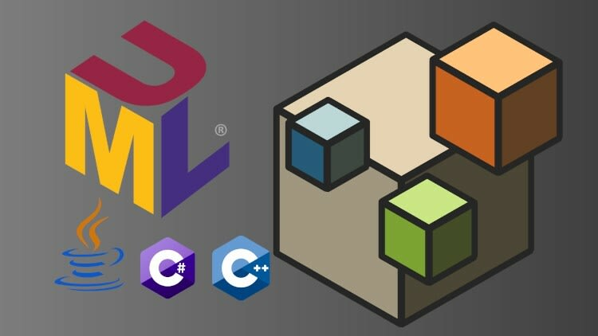

# Інструменти проектування

## Загальні відомості

Важливими інструментами для моделювання та проектування програмних систем є:
- UML (Unified Modeling Language) - уніфікована мова моделювання
- OOD (Object Oriented Design) - об'єктно-орієнтоване проектування

Ці інструменти служать різним цілям і використовуються різними людьми в процесі розробки. UML забезпечує стандартизований спосіб моделювання та документування програмних систем, у той час як OOD є підходом до проектування, що використовується для створення та реалізації цих систем. При спільному використанні UML та OOD можуть гарантувати, що програмні системи спроектовані та побудовані таким чином, щоб їх було легко зрозуміти, підтримувати та модифікувати з часом.

- [Інструменти програмної інженерії — posibniki.com.ua](https://posibniki.com.ua/post-instrumenti-programnoio-inzheneriio)
- [Кибермедиана — cybermedian.com](https://www.cybermedian.com/ru/) - изучайте одну новую вещь каждый день
- [UML vs Object Oriented Design — cybermedian.com](https://www.cybermedian.com/uml-vs-object-oriented-desig/)

## UML

UML — це візуальна мова, яка використовується для моделювання програмних систем. Вона надає стандартний набір графічних елементів, які використовуються для створення діаграми, що представляє архітектуру, дизайн і поведінку програмної системи.

UML надає стандартизований спосіб моделювання та документування програмних систем, що забезпечує професіоналам у сфері програмного забезпечення можливість ділитися своїми проектами та ідеями з іншими. 

Крім того, UML можна використовувати для генерації коду, що скорочує обсяг ручного кодування та прискорює процес розробки.

- [Уніфікована мова моделювання UML — znannya.org](http://www.znannya.org/?view=uml)
- [UML Specification — omg.org](https://www.omg.org/spec/UML/)

## OOD

OOD є підхід до проектування, що використовується для створення програмних систем. Він заснований на принципах об'єктно-орієнтованого програмування, що прагне моделювати програмні системи як набори об'єктів, що взаємодіють один з одним.

Підхід об'єктно-орієнтованого проектування приділяє велику увагу інкапсуляції, успадкування та поліморфізму, що дозволяє розробникам створювати модульні та багаторазово використовувані програмні системи.

## Ключові концепції

Ключові концепції, з яких складається об'єктно-орієнтований світ:

- **Об'єкти** є сутностями реального світу і є основним елементом.
- **Клас** є зразком для об'єкта.
- **Абстракція** є поведінкою об'єкта реального світу.
- **Інкапсуляція** зв'язує дані разом та захищає їх від зовнішніх впливів.
- **Успадкування** дозволяє створювати нові класи з існуючих.
- **Поліморфізм** визначає здатність існувати у кількох формах. 

Відносини між класами та об'єктами:

- **Успадкування** дозволяє одному класу (спадкоємцю) успадкувати функціонал іншого класу (батьківського). Нерідко відносини успадкування ще називають генералізацією чи узагальненням. Наслідування визначає відношення **IS A**, тобто "є".
- **Реалізація** передбачає визначення інтерфейсу та її реалізація у класах.
- **Асоціація** - це ставлення, у якому об'єкти одного типу певним чином пов'язані з об'єктами іншого типу. Наприклад, об'єкт одного типу містить або використовує об'єкт іншого типу.
- **Композиція** визначає відношення HAS A, тобто відношення "має". Клас містить об'єкт якогось класу і повністю управляє життєвим циклом цього об'єкта.
- **Агрегація** також визначає відношення HAS A, але відрізняється від композиції тим, що в конструктор класу передається посилання на об'єкт іншого класу. Таким чином реалізується слабкий зв'язок між об'єктами та об'єкти рівноправні.
   Зазвичай, визначається посилання не на конкретний клас, а на абстрактний клас чи інтерфейс, що збільшує гнучкість програми.

  > [Відносини між класами та об'єктами — metanit.com](https://metanit.com/sharp/patterns/1.2.php)