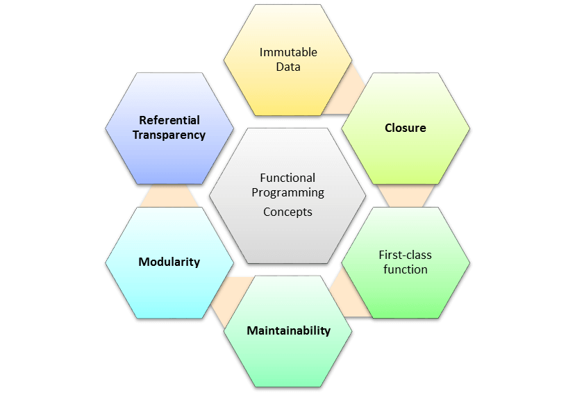

# Функціональне програмування

## Загальні відомості

Функціональне програмування (ФП) — це стиль програмування, який спирається на обчислення виразів, а не на виконання команд. Вирази формуються у вигляді комбінування функцій. Функціональна мова – це мова, яка підтримує та заохочує програмування у функціональному стилі.

## Концепції ФП

Функціональне програмування ґрунтується на кількох важливих концепціях:

- незмінні дані
- прозорість посилань
- модульність
- ремонтопридатність
- замыкание
- функції вищого ладу
- чиста функція
- композиція функцій

### Незмінні дані

Незмінні дані означають, що ви повинні легко створювати структури даних замість зміни існуючих.

### Прозорість посилань

Функціональні програми повинні виконувати операції так само, якби це було вперше. Таким чином, ви знатимете, що могло чи не могло статися під час виконання програми, та її побічні ефекти. У термінах ФП це називається прозорістю посилань.

### Модульність

Модульна конструкція збільшує продуктивність. Невеликі модулі можуть бути написані швидко і мають більше шансів повторного використання, що, безумовно, призводить до більш швидкої розробки програм. Крім того, модулі можна тестувати окремо, що допомагає скоротити час, що витрачається на модульне тестування та налагодження.

### Ремонтопридатність

Ремонтопридатність - це простий термін, який означає, що програмування FP легше підтримувати, оскільки вам не потрібно турбуватися про випадкову зміну чогось поза даною функцією.

"Першокласна функція" - це визначення, що стосується сутностей мови програмування, які не мають обмежень на їх використання. Тому першокласні функції можуть з'являтися будь-де програми.

### Замикання

Замикання – це внутрішня функція, яка може звертатися до змінних батьківських функцій навіть після виконання батьківської функції.

### Функції вищого ладу

Функції вищого порядку або приймають інші функції як аргументи, або повертають їх як результати.

Функції вищого ладу допускають часткове застосування або карірування. Цей метод застосовує функцію до своїх аргументів по одному, тому що кожен додаток повертає нову функцію, яка приймає наступний аргумент.

### Чиста функція

"Чиста функція" - це функція, входи якої оголошені як входи, і жоден з них не повинен бути прихований. Виходи також оголошуються як виходи.

Чисті функції впливають на свої параметри, неефективно, якщо нічого не повертається. Більше того, вона повертає той же результат для тих самих заданих параметрів.

### Композиція функцій

Композиція функцій – це підхід у функціональному програмуванні, який передбачає виклик одних функцій як аргументів інших, до створення складних складових функцій з простих. Це об'єднання двох або більше функцій для створення нової.

## Користь функціонального програмування

Функціональне програмування допомагає зробити код чистішим, передбачуваним та легко читаним. Використання принципів ФП допомагає позбутися зайвих абстракцій з непередбачуваною поведінкою, отже зробити роботу програми більш передбачуваною і знизити кількість можливих помилок.

## Недоліки функціонального програмування

Функціональне програмування погано підходить для алгоритмів, заснованих на графах через порівняно повільнішу роботу програми. ФП в цілому погано застосовується у рішеннях, які роками ґрунтувалися на використанні імперативного підходу.

Найважливіше – у функціональних мовах немає ефективного невпорядкованого словника множини. У порівнянні з хеш-таблицями, функціональні словники працюють значно гірше, а це може бути критично для деяких програм.

- [функциональное и объектно-ориентированное программирование — scand.com](https://scand.com/ru/company/blog/functional-programming-vs-oop/)
- [What is Functional Programming? Tutorial with Example — guru99.com](https://www.guru99.com/functional-programming-tutorial.html)
- [Полное руководство по языку программирования F# — metanit.com](https://metanit.com/f/tutorial/)