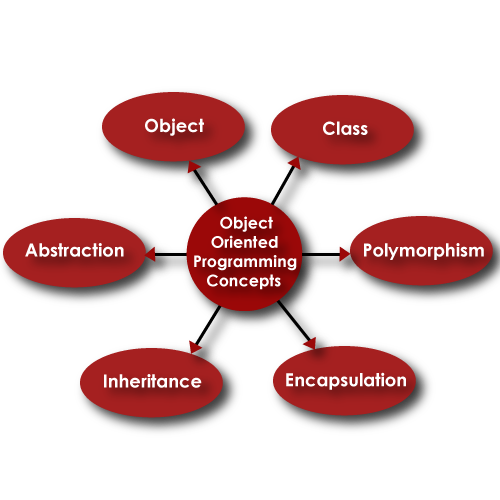

# Об'єктно-орієнтоване програмування

## Загальні відомості

Об'єктно-орієнтоване програмування (ООП) фокусується на об'єктах, якими розробники хочуть маніпулювати, а не на логіці, яка потрібна на маніпулювання ними. Програму можна у вигляді взаємопов'язаних взаємодіючих між собою об'єктів.

Цей підхід до програмування добре підходить для великих, складних та активно оновлюваних або підтримуваних програм.

ООП сприяє спільній розробці, коли проект можна поділити на складові. Додаткові переваги ООП включають повторне використання коду, масштабованість та ефективність.

## Клас

Клас (**Class**) - це опис типу об'єкта, представлена такими його членами:

- поля – змінні, зазвичай доступ здійснюється через властивості
- властивості - характеристики об'єкта та його стан
- методи - дії, можливі з цим типом об'єкта
- події – об'єкти для підключення зовнішніх делегатів – обробників подій.

Також у класу можуть визначатися конструктори та деструктори, які призначені для завдання вихідного стану об'єкта в момент створення та його знищення відповідно.

## Об'єкт

Об'єкт (**Object**) являє собою екземпляр заданого типу у якого повністю автономна не статична частина класу і всі статичні властивості та методи класу впливають тільки на поточний об'єкт.

## Базові засади ООП

### Абстракція

Абстракція в об'єктно-орієнтованому програмуванні - це використання лише тих характеристик об'єкта, які з достатньою точністю становлять його в даній системі. Основна ідея полягає в тому, щоб представити об'єкт мінімальним набором полів та методів і при цьому з достатньою точністю для задачі, що розв'язується.

### Поліморфізм

Можливість у дочірніх класах перевизначати методи, позначені у батьківському класі як віртуальні, або реалізовувати у класі методи відповідно до абстрації як інтерфейсів.

Це дозволяє клієнтському коду працювати з однаковим інтерфейсом без інформації про тип та внутрішню структуру об'єкта.

Багато мов програмування підтримують і параметричний поліморфізм як результат узагальненого програмування (англ. generic programming) — парадигми програмування, що полягає в такому описі даних і алгоритмів, який можна застосовувати до різних типів даних, не змінюючи саме цей опис.

При застосуванні генериків класи відповідного типу створюються автоматично на етапі компіляції або інтерпретації під час виконання коду і підтримується сувора типізація.

### Успадкування

Успадкування як _узагальнення_ — здатність об'єкта чи класу базуватися на іншому об'єкті чи класі. Це головний механізм повторного використання коду. Спадкове ставлення класів чітко визначає їхню ієрархію.

Спадкування може виконуватися і як реалізація - визначення інтерфейсу та його реалізація в класах.

Спадкування описується словом «є».

### Інкапсуляція

Об'єкти інкапсулюють в собі дані та методи роботи з ними, надаючи публічні інтерфейси для взаємодії.

## Відносини між класами та об'єктами

Крім відношення між класами як успадкування широко використовується асоціація - це відношення, при якому об'єкти одного типу якимось чином пов'язані з об'єктами іншого типу і описується словом «має» або «включає» за типом як:

- `композиція` - включення об'єктом-контейнером об'єкта-вмісту та управління його поведінкою; останній не може існувати поза першим
- `агрегація` - включення об'єктом-контейнером посилання на об'єкт-вміст; при знищенні першого останній продовжує існування

Зв'язок між об'єктами можна здійснювати і частковий через "делегацію" - підключення методу одного об'єкта або одночасно кількох до делегата іншого об'єкта. Делегат по суті це спеціальна властивість об'єкта, що є посиланням на об'єкт, який вказує на метод або колекцію методів з певною сигнатурою.

## Принципи SOLID

### Про SOLID

Застосування ООП не означає, що розробник застрахований від можливості створення незрозумілого, заплутаного коду, який важко підтримувати. Роберт Мартін, для того, щоб допомогти всім охочим розробляти якісні ООП-додатки, розробив п'ять принципів об'єктно-орієнтованого програмування та проектування, говорячи про які, з подачі Майкла Фезерса, використовують акронім SOLID.

- **S**: `SRP` _Single Responsibility Principle_ (принцип єдиної відповідальності)
- **O**: `OCP` _Open-Closed Principle_ (принцип відкритості-закритості)
- **L**: `LSP` _Liskov Substitution Principle_ (принцип підстановки Барбари Лисков)
- **I**: `ISP` _Interface Segregation Principle_ (принцип поділу інтерфейсів)
- **D**: `DIP` _Dependency Inversion Principle_ (принцип інверсії залежностей)

Головна мета цих принципів – підвищити гнучкість вашої архітектури, зменшити зв'язаність між її компонентами та полегшити повторне використання коду.

Але, як і все у цьому житті, дотримання цих принципів має власну ціну. Це переважно виявляється у ускладненні коду програми. У реальному житті, мабуть, немає такого коду, в якому дотримувалися б всі ці принципи відразу. Тому пам'ятаєте про баланс і не сприймайте все викладене як догму.

### Принцип єдиної відповідальності

Кожен клас повинен вирішувати лише одне завдання, але може мати багато членів, якщо вони належать до єдиної відповідальності. Наприклад, сам клас сутності не повинен мати відповідальність за збереження свого ж об'єкта або звітність, що формується про себе.

### Принцип відкритості-закритості

Програмні сутності (класи, модулі, функції) мають бути відкриті для розширення, але не для модифікації. Наприклад, у C# ми можемо використовувати для цього успадкування від абстрактного інтерфейсу, при цьому конкретна реалізація програмної сутності може бути винесена в окремий модуль і підключатися через механізм інверсії залежностей.

### Принцип підстановки Барбари Лисків

Функції, які використовують базовий тип, повинні мати можливість використовувати підтипи базового типу, не знаючи про це. Наслідуючий клас має доповнювати, а не замінювати поведінку базового класу.

### Принцип поділу інтерфейсів

Принцип поділу інтерфейсів свідчить, що клієнти нічого не винні примусово впроваджувати інтерфейси, які вони не використовують. Створюйте вузькоспеціалізовані інтерфейси, призначені для конкретного клієнта.

### Принцип інверсії залежностей

Об'єктом залежності має бути абстракція, а не щось конкретне.

Цей принцип говорить, що,

- по-перше, програмні сутності високого рівня не повинні залежати від низькорівневих програмних сутностей. При цьому обидва мають залежати від абстракцій.
- по-друге, абстракції не повинні залежати від деталей, але деталі повинні залежати від абстракцій.

Класи високого рівня реалізують бізнес-правила чи логіку у системі (додатку). Низькорівневі класи займаються докладнішими операціями, іншими словами, вони можуть займатися записом інформації в базу даних або передачею повідомлень в операційну систему або служби тощо.

## Додаткові матеріали

- [Объектно-ориентированное программирование (ООП). Объясняем на пальцах — highload.today](https://highload.today/obektno-orientirovannoe-programmirovanie/)
- [Объектно-ориентированное программирование (C#) — metanit.com](https://metanit.com/sharp/tutorial/3.7.php)
- [A Complete Guide To Object Oriented Programming In C# — c-sharpcorner.com](https://www.c-sharpcorner.com/UploadFile/84c85b/object-oriented-programming-using-C-Sharp-net/)

- [Solid Principles with C# .NET Core — procodeguide.com](https://procodeguide.com/design/solid-principles-with-csharp-net-core/)
- [C# SOLID Principles — dev.to](https://dev.to/bytehide/uncover-single-responsibility-principle-in-c-with-examples-c-solid-principles-oe7)
- [S.O.L.I.D. Principles of Object-Oriented Programming in C# — educative.io](https://www.educative.io/blog/solid-principles-oop-c-sharp)
- [Принципы S.O.L.I.D. в картинках — bimlibik.github.io](https://bimlibik.github.io/posts/solid-in-pictures/)

