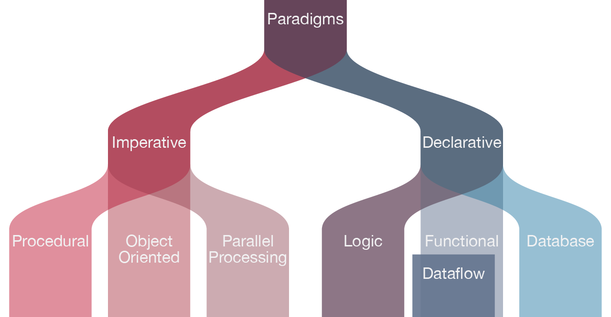
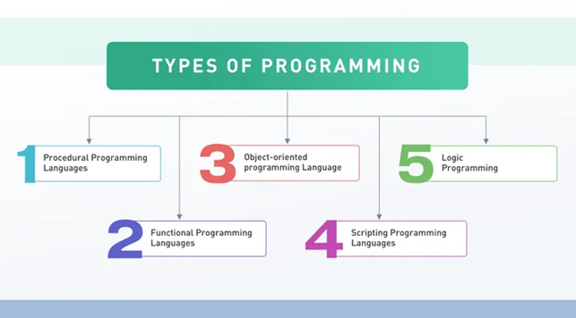

# Парадигми програмування

## Підходи до програмування

Є два основні підходи до програмування:

- `імперати́вне програмува́ння` — парадигма програмування, згідно з якою описується процес отримання результатів як послідовність інструкцій зміни стану програми.
- `декларативне програмування` — парадигма програмування, відповідно до якої, програма описує, який результат необхідно отримати, замість описання послідовності отримання цього результату.

## Типи програмування 

Базові типи програмування:

1. `процедурне програмування`, структуроване програмування - визначає кроки, які має виконати програма, щоб досягти бажаного стану (імперативний підхід)
2. `функціональне програмування` - це парадигма програмування, в якій програми створюються шляхом застосування та створення функцій (декларативний підхід). Це парадигма декларативного програмування, в якій визначення функцій представляють собою дерев’я виражень, які відображають значення в інших значеннях, а не послідовність імперативних операторів, які оновлюють поточний стан програми. 
3. `об'єктно-орієнтоване програмування (ООП)` - організує програми як об'єкти: структури даних, що складаються з полів даних та методів разом з їх взаємодіями (імперативний підхід)
4. `скриптові` - не потребують етапу компіляції
5. `логічні` - засновані мови на формальній логіці, вони не вказують машинам, що потрібно робити, але залишають обмеження на завдання.

Підтримувані типи програмування є одними з найбільш важливих ознак при порівнянні та виборі підходящої мови програмування.

Підпрограми, які реалізують методи ООП, можуть в кінцевому підсумку бути закодовані в імперативному, функціональному або процедурному типіі, який може або не може напряму змінити стан від імені викличної програми. Между парадигмами неизбежно есть некоторое совпадение.

## Інші парадигми

Нижче наведені поширені види програмування, які можуть бути реалізовані з використанням різних парадигм:

- `програмування, кероване подіями` - потік управління програмою визначається подіями, такими як вхідні дані датчика або дії користувача (щелчки миші, нажаття клавіш) або повідомлення від інших програм або потоків
- `реактивне програмування` - це декларативна парадигма програмування, пов'язана з потоками даних і внесенням змін. Реагує на події, а не вимагає введення даних від користувачів.
- `програмування на основі автоматів` - програма або її фрагмент розглядаються як модель деякого формального автомата, а вибір операції обробки вхідних даних визначається не тільки поточним значенням даних, але й поточним значенням стану автомата.

## Ресурси

- [Как сравнить языки — dou.ua](https://dou.ua/forums/topic/43658/)
- [Стили и парадигмы программирования и выбор языка программирования — intellect.icu](https://intellect.icu/stili-i-paradigmy-programmirovaniya-i-vybor-yazyka-programmirovaniya-pri-razrabotke-programmnogo-produkta-primery-i-prezentatsiya-6183)
- [Парадигмы программирования: простое объяснение — highload.today](https://highload.today/paradigmy-programmirovaniya/)
- [Найбільш затребувані мови програмування у 2023 році — merehead.com](https://merehead.com/ua/blog/most-in-demanding-programming-languages-2023/)
- [Програми, керовані подіями — ts2.space](https://ts2.space/uk/програми-керовані-подіями/)
- [Парадигма програмування — wikipedia.org](https:/uk.wikipedia.org/wiki/Парадигма_програмування)
- [Reactive programming — techtarget.com](https://www.techtarget.com/searchapparchitecture/definition/reactive-programming)