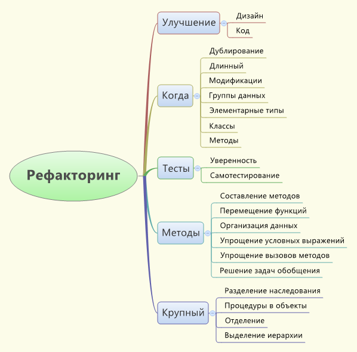

# Рефакторинг

## Основні відомості

Рефакторинг являє собою процес такої зміни програмної системи, при якому не змінюється зовнішня поведінка коду, але покращується його внутрішня структура. Це спосіб систематичного приведення коду до порядку, у якому шанси появи нових помилок мінімальні. По суті, під час проведення рефакторингу коду ви покращуєте його дизайн вже після того, як він написаний.

Переписування передбачає порятунок від більшої частини, якщо не від усього, вихідного коду програмного забезпечення та початок заново.

Обидва підходи мають свої плюси та мінуси, але зрештою правильний вибір залежатиме від конкретної ситуації та цілей проекту. [Детальніше...](https://methodpoet.com/refactoring-vs-rewrite)

## Правила рефакторингу

- Виявивши, що до програми необхідно додати нову функціональність, але код програми не структурований зручним для додавання цієї функціональності чином, спочатку зробіть рефакторинг програми, щоб спростити внесення необхідних змін, а потім додайте функцію.
- Перед початком рефакторингу переконайтеся, що маєте надійний комплект тестів. Ці тести повинні бути самоперевірювальними.
- При застосуванні рефакторингу програма модифікується невеликими кроками, при цьому помилку легко знайти.

Ритм рефакторингу: тестування, малі зміни, тестування, малі зміни, тестування, малі зміни. Саме такий ритм робить рефакторинг швидким та надійним.

## Принципи рефакторингу

Рефакторинг (Refactoring): зміна у внутрішній структурі програмного забезпечення, що має на меті полегшити розуміння його роботи і спростити модифікацію, не торкаючись спостерігається поведінки.
Проводити рефакторинг (Refactor): змінювати структуру програмного забезпечення, застосовуючи ряд рефакторингів, не торкаючись його поведінки.

Рефакторинг (Refactoring): зміна у внутрішній структурі програмного забезпечення, що має на меті полегшити розуміння його роботи і спростити модифікацію, не зачіпаючи поведінку, що спостерігається.

## Навіщо потрібно проводити рефакторинг

- Рефакторинг покращує композицію програмного забезпечення
- Рефакторинг полегшує розуміння програмного забезпечення
- Рефакторинг допомагає знайти помилки
- Рефакторинг дозволяє швидше писати програми

## Коли слід проводити рефакторинг

Рефакторинг слід займатися постійно потроху. Потрібно не вирішувати проводити рефакторинг, а проводити його, тому що необхідно зробити щось ще, а допоможе в цьому рефакторинг.

- Застосовуйте рефакторинг при додаванні нової функції
- Застосовуйте рефакторинг, якщо потрібно виправити помилку
- Застосовуйте рефакторинг при розборі коду

## Коли рефакторинг не потрібен

У деяких випадках рефакторинг взагалі не потрібний. Основний приклад – необхідність переписати програму з нуля. Іноді наявний код настільки заплутаний, що його рефакторингу, звичайно, можна, але простіше почати все з самого початку.

Явна ознака необхідності переписати код – його непрацездатність. Це виявляється тільки при тестуванні, коли помилок виявляється так багато, що зробити код стійким не вдається. Пам'ятайте, що перед початком рефакторинг код повинен виконуватися в основному коректно.

Інший випадок, коли слід утримуватись від рефакторингу, це близькість дати завершення проекту. Зростання продуктивності, яке досягається завдяки рефакторингу, проявить себе занадто пізно — після закінчення терміну.

Проте наближення терміну закінчення робіт — єдиний випадок, коли можна відкласти рефакторинг, посилаючись на нестачу часу. Проведення рефакторингу призводить до зростання продуктивність праці. Нестача часу зазвичай сигналізує необхідність рефакторинга.

## Рефакторинг та проектування

Рефакторинг грає особливу роль як доповнення до проектування. Якщо заздалегідь подумати про архітектуру програми, можна уникнути подальшої дорогої переробки. Багато хто вважає, що проектування найважливіше, а програмування є механічним процесом. Аналогією проекту є технічне креслення, а аналогією коду — виготовлення вузла. Але програма дуже відрізняється від фізичного механізму. Вона значно податливіша і пов'язана з обдумуванням. Як каже Елістер Кокберн (Alistair Cockburn):
"За наявності готового дизайну я думаю дуже швидко, але в моєму мисленні повно прогалин".

Існує твердження, що рефакторинг може бути альтернативою попереднього проектування. У такому сценарії проектування взагалі відсутнє. Перше рішення, що спало на думку, втілюється в коді, доводиться до робочого стану, а потім набуває необхідної форми за допомогою рефакторингу. Такий підхід може діяти. Зустрічаються люди, які так працюють та отримують у результаті систему з дуже гарною архітектурою. Тих, хто підтримує «екстремальне програмування», часто є пропагандистами такого підходу.

Підхід, що обмежується лише рефакторингом, застосовний, але не є найефективнішим. Навіть «екстремальні» програмісти спочатку розробляють архітектуру майбутньої системи. Вони пробують різні ідеї за допомогою CRC-карт або чогось подібного, поки не отримають довіри початкового рішення, що вселяє. Тільки після першого більш менш вдалого «пострілу» приступають до кодування, а потім до рефакторингу. Сенс у цьому, що з використанні рефакторинга змінюється роль попереднього проектування.

Якщо не розраховувати на рефакторинг, то відчувається необхідність якнайкраще провести попереднє проектування. Виникає почуття, що будь-які зміни проекту в майбутньому, якщо вони будуть потрібні, виявляться надто дорогими. Тому в попереднє проектування вкладається більше часу та зусиль — щоб уникнути таких змін згодом.

Із застосуванням рефакторингу акценти зміщуються. Попереднє проектування зберігається, але тепер воно не має на меті знайти єдино правильне рішення. Все, що від нього вимагається, — знайти прийнятне рішення. У міру реалізації рішення, з поглибленням розуміння завдання стає ясно, що найкраще рішення відрізняється від того, яке було ухвалено спочатку. Але в цьому немає нічого страшного, якщо в процесі бере участь рефакторинг, тому що модифікація не коштує занадто дорого.

Рефакторинг надає інший підхід до ризиків модифікації. Можливі зміни все одно треба намагатись передбачати, як і розглядати гнучкі рішення. Але замість реалізації цих гнучких рішень слід поставити запитання: «Наскільки складно буде за допомогою рефакторингу перетворити звичайне рішення на гнучке?» Якщо, як найчастіше трапляється, відповідь буде «дуже нескладно», треба просто реалізувати звичайне рішення.

Рефакторинг дозволяє створювати простіші проекти, не жертвуючи гнучкістю, завдяки чому процес проектування стає легшим і менш напруженим. Навчившись загалом розпізнавати те, що легко піддається рефакторингу, про гнучкість рішень навіть перестаєш замислюватися. З'являється впевненість у можливості застосування рефакторингу, коли це знадобиться. Створюються найпростіші рішення, які можуть працювати, а гнучкі та складні рішення здебільшого не будуть потрібні.

З рефакторингом зазвичай пов'язане питання його впливу на продуктивність програми. З метою полегшити розуміння роботи програми, часто здійснюється модифікація, що призводить до уповільнення виконання програми. Рефакторинг, безсумнівно, змушує програму виконуватися повільніше, але робить її більш податливою налаштування продуктивності. Секрет створення швидких програм, якщо вони не призначені для роботи в жорсткому режимі реального часу, полягає в тому, щоб спочатку написати програму, яку можна налаштовувати, а потім налаштувати її так, щоб досягти прийнятної швидкості.

Другий підхід передбачає постійну увагу. У цьому випадку кожен програміст у будь-який момент часу робить все, що від нього залежить, щоб підтримувати високу продуктивність програми. Це поширений та інтуїтивно привабливий підхід, проте він не такий добрий на ділі. Модифікація, що підвищує продуктивність, зазвичай ускладнює роботу з програмою. Це уповільнює створення програми. На це можна було б піти, якби в результаті виходило швидше програмне забезпечення, але зазвичай цього не відбувається. Підвищують швидкість удосконалення розкидані по всій програмі, і кожне стосується лише вузької функції, виконуваної програмою.

З продуктивністю пов'язана та цікава обставина, що при аналізі більшості програм виявляється, що більшість часу витрачається невеликою частиною коду. Якщо рівною мірою оптимізувати весь код, то виявиться, що 90% оптимізації зроблено марно, тому що оптимізувався код, який виконується не надто часто. Час, що пішов на прискорення програми, і час, втрачений через її незрозумілість — це витрачено даремно.

Третій підхід до підвищення продуктивності програми заснований саме на цій статистиці. Він передбачає створення програми з достатнім розкладанням її на компоненти без огляду на продуктивність, що досягається, аж до етапу оптимізації продуктивності, який зазвичай настає на досить пізній стадії розробки і на якому здійснюється особлива процедура налаштування програми. Починається все із запуску програми під профайлером, який контролює програму та повідомляє, де витрачаються час і пам'ять. Завдяки цьому можна знайти ту невелику ділянку програми, в якій знаходяться вузькі місця продуктивності. На цих вузьких місцях зосереджуються зусилля, і здійснюється та сама оптимізація, яка була б застосована при підході з постійною увагою. Але завдяки тому, що увага зосереджена на виявлених вузьких місцях, вдається досягти більших результатів за значно менших витрат праці. Але навіть у цій ситуації необхідна пильність. Як і при проведенні рефакторингу, зміни слід вносити невеликими порціями, щоразу компілюючи, тестуючи та запускаючи профайлер. Якщо продуктивність не збільшилася, змінам дається зворотний перебіг. Процес пошуку та ліквідації вузьких місць продовжується до досягнення продуктивності, яка задовольняє користувачів.

## Розробка тестів

При проведенні рефакторингу важливою умовою є наявність надійних тестів.

Правила розробки тестів:

- Робіть всі тести повністю автоматичними, щоб вони перевіряли власні результати.
- Комплект тестів є потужним детектором помилок, що різко скорочує час їх пошуку.
- Найчастіше запускайте тести. Запускайте тести при кожній компіляції – кожен тест хоча б щодня.
- Отримавши повідомлення про помилку, почніть із створення тесту модуля, який показує цю помилку.
- Краще написати та виконати неповні тести, ніж не виконати повні тести.
- Подумайте про граничні умови, які можуть бути неправильно опрацьовані, і зосередьте на них свої тести.
- Не забувайте перевіряти, щоб у разі виникнення проблем генерувалися виняткові ситуації.
- Побоювання з приводу того, що тестування не виявить усі помилки, не повинно перешкодити написанню тестів, які виявлять більшість помилок.

## Проблеми рефакторингу

- Потреба вносити зміни до існуючого коду
- Необхідність суворо дотримуватись поставленого завдання
- Покривати код перевірочними тестами

## Ознаки, що Вам потрібний рефакторинг

- Ваш програмний продукт працює, але внесення нової функціональності іноді затягується на тижні;
- У певних місцях Ваш код працює зовсім не так, як Ви того очікували;
- Ви часто помиляєтеся у термінах реалізації поставленого завдання;
- Вам доводиться вносити однотипні зміни у різних місцях.

## Методи рефакторингу

- Інкапсуляція поля (Encapsulate Field);
- Виділення класу (Extract Class);
- Виділення інтерфейсу (Extract Interface);
- Виділення локальної змінної (Extract Local Variable);
- Виділення методу (Extract Method);
- Генералізація типу (Generalize Type);
- Вбудовування (Inline);
- Запровадження фабрики (Introduce Factory);
- Введення параметра (Introduce Parameter);
- Підйом поля/методу (Pull Up);
- Спуск поля/методу (Push Down);
- Заміна умовного оператора поліморфізмом (Replace Conditional with Polymorphism);
- і так далі;

## Додаткові матеріали

- [Рефакторинг — refactoring.guru](https://refactoring.guru/uk/refactoring)
- [Рефакторинг у програмуванні: підвищуємо якість коду — foxminded.ua](https://foxminded.ua/refaktorynh/)
- [Top Code Refactoring Tools for C# Developers — codeguru.com](https://www.codeguru.com/csharp/top-code-refactoring-tools/)
- [Refactoring vs Rewrite: What We Have Learned Until 2023 — methodpoet.com](https://methodpoet.com/refactoring-vs-rewrite/)
