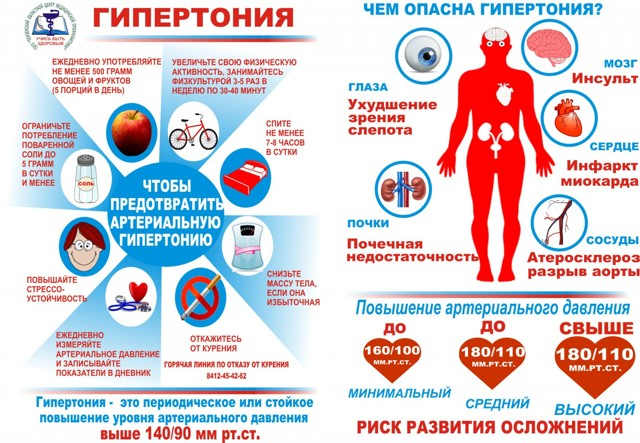
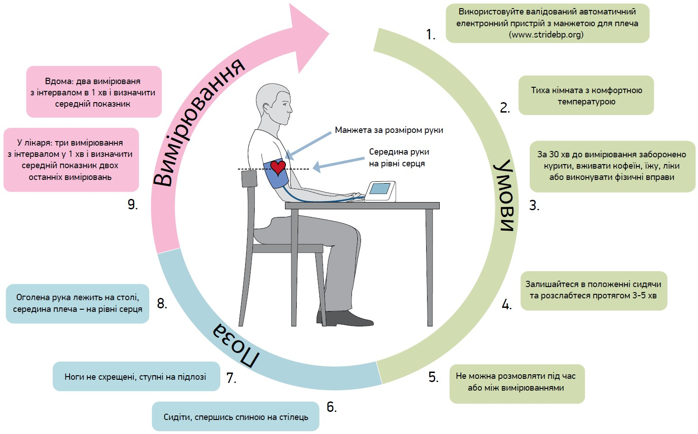
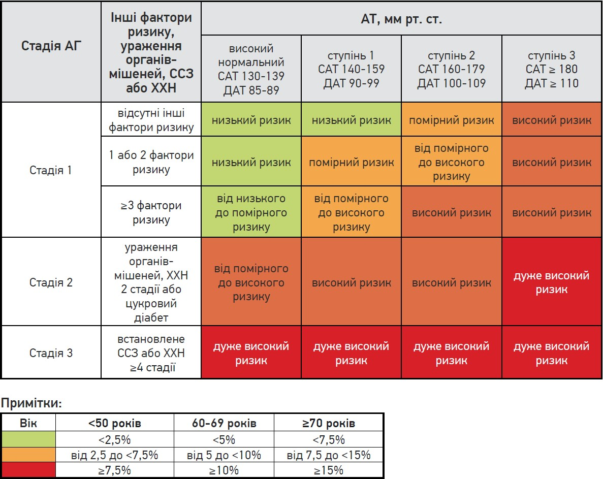

# Артеріальна гіпертензія

## Огляд

Підвищення артеріального тиску примушує серце працювати з більшим навантаженням через підвищений загальний периферичний судинний опір для забезпечення нормального обертання крові в кровоносних судинах великого кола кровообігу.

### Терміни

**Артеріальна гіпертензія** (***АГ***) - це не сама патологія, а скоріше констатація факту підняття кров'яного тиску вище за норму. Для його визначення у пацієнта за допомогою тонометра вимірюються показники кров'яного артеріального тиску (***АТ***): систолічний (***САТ***) у момент скорочення міокарда та діастолічний (***ДАТ***) під час його розслаблення.

**Гіпертонія** - це критичний стан серцевої та судинної системи, що характеризується стійким підвищенням кров'яного тиску. Гіпертонія - це комплекс системних патологічних відхилень в організмі, які зберігаються та посилюються протягом усього життя. Це поширене явище, але може бути серйозним, якщо його не лікувати.

**Серцево-судинні захворювання** (***ССЗ***) - клас захворювань, які пов'язані з патологією серця або кровоносних судин, загальна назва захворювань системи кровообігу. До серцево-судинних захворювань належать ішемічна хвороба серця до якої зараховують стенокардію та інфаркт міокарда (відомий як серцевий напад). До ССЗ також зараховують інсульт, серцеву недостатність (зокрема, пов'язану з високим кров'яним тиском), кардіоміопатію, аритмію, вроджені і набуті вади серця, аневризму аорти, хвороби периферійних артерій, тромбоз, тромбофлебіт.

**Ішемічна хвороба серця** (***ІХС**) - захворювання, яке виникає внаслідок абсолютного або відносного порушення кровопостачання міокарда через ураження коронарних артерій серця, що призводить до недостатнього кровопостачання серцевого м'яза. Переважно ішемічну хворобу серця зумовлює атеросклероз. Внаслідок утворення атеросклеротичної бляшки просвіт судини звужується. Слід зазначити, що атеросклероз може розвинутися не тільки в коронарних, але й в будь-яких інших судинах людського організму.

**Хронічна хвороба нирок** (***ХХН***) ― це триваюче протягом більше 3 місяців значиме для здоров'я прогресувальне порушення функцій нирок (перш за все видільної), що виникає поступово, упродовж тривалого часу та призводить до уремічної інтоксикації (скупченню у крові азотистих шлаків). Захворювання класифікується на 5 стадій, які різняться за тактикою ведення хворого та ризиком розвитку термінальної ниркової недостатності та серцево-судинних ускладнень.

### Гіпертонія

**Гіпертонія є основною причиною передчасної смерті у всьому світі**. \
Люди з високим кров'яним тиском можуть не відчувати симптомів. Єдиний спосіб дізнатися про це – перевірити артеріальний тиск.

Речі, які підвищують ризик високого кров'яного тиску, включають:

- похилий вік
- генетика
- надмірна вага або ожиріння
- неактивна фізична активність
- дієта з високим вмістом солі
- вживання занадто великої кількості алкоголю

**Зміни способу життя, такі як здорове харчування, відмова від тютюну та більш активна активність, можуть допомогти знизити кров'яний тиск. Деяким людям все ще може знадобитися прийом ліків.**

### Ключові факти по гіпертонії

За станом на 2023 рік за [оцінками ВООЗ](https://www.who.int/news-room/fact-sheets/detail/hypertension):

- 1,28 мільярда дорослих у віці 30-79 років у всьому світі страждають на гіпертонію, більшість (дві третини) живуть у країнах з низьким і середнім рівнем доходу
- 46% дорослих з гіпертонією не знають, що у них є це захворювання
- менше половини дорослих (42%) з артеріальною гіпертензією діагностуються і лікуються
- приблизно 1 з 5 дорослих (21%) з артеріальною гіпертензією контролює її
- гіпертонія є основною причиною передчасної смерті у всьому світі

## Основні правила вимірювання АТ

Рекомендації щодо вимірювання АТ наведено на рисунку

## Класифікація АГ

| Категорія АТ / ступінь АГ | САТ, мм рт. ст. |        | ДАТ, мм рт. ст. |
|---------------------------|-----------------|--------|-----------------|
| Оптимальний               | < 120           | та     | < 80            |
| Нормальний                | 120-129         | та     | 80-84           |
| Високий нормальний        | 130-139         | та/або | 85-89           |
| АГ 1 ступеня              | 140-159         | та/або | 90-99           |
| АГ 2 ступеня              | 160-179         | та/або | 100-109         |
| АГ 3 ступеня              | ≥ 180           | та/або | ≥ 110           |
| Ізольована систолічна гіпертензія | ≥ 140   | та     | < 90            |
| Ізольована діастолічна гіпертензія | < 140  | та     | ≥ 90            |

Примітки: 
- категорія АТ визначається найвищим рівнем АТ (САТ або ДАТ)
- ступінь ізольованої систолічної чи діастолічної гіпертензії оцінюється як 1, 2, 3 відповідно до значень САТ і ДАТ у зазначених діапазонах
- така сама класифікація використовується для підлітків віком ≥16 років.

На додаток до ступенів АГ, які базуються на значеннях АТ, розрізняють стадії захворювання:

- стадія 1: неускладнена АГ (без ураження органів-мішеней, установленого ССЗ або ХХН ≥2 стадії)
- стадія 2: наявність ураження органів-мішеней, ХХН 3 ступеня або цукрового діабету
- стадія 3: встановлене ССЗ або ХХН 4 або 5 стадії.

## Серцево-судинний ризик

Існує чіткий зв’язок між підвищенням АТ і ризиком ССЗ та ХХН. Це стосується всіх вікових та етнічних груп. Установлено, що для кожного підвищення офісного САТ на 20 мм рт. ст. або офісного ДАТ на 10 мм рт. ст. ризик летальної ІХС або інсульту подвоюється. Крім того, АГ часто пов’язана з іншими факторами ризику, включаючи дисліпідемію, порушення толерантності до глюкози та цукровий діабет 2 типу, що додатково підвищує ризик ССЗ. Оцінка загального серцево-судинного ризику рекомендована для кожного пацієнта з АГ, оскільки це важливо для вибору лікування.

## Який лікар лікує гіпертонію

Якщо пацієнт відзначає періодичну появу симптомів артеріальної гіпертензії, необхідно звернутися до терапевта або кардіолога. Ці фахівці займаються діагностикою та лікуванням гіпертонічної хвороби. Для уточнення діагнозу і вибору найбільш ефективної схеми лікування лікар призначить обов'язкові аналізи та інструментальні дослідження (при необхідності).

Після отримання результатів всіх обстежень терапевт при необхідності додатково призначить консультації фахівців. Зазвичай потрібно візит до невролога, офтальмолога, психотерапевта. За результатами формулюється розгорнутий діагноз із зазначенням ускладнень і можливих ризиків, визначається схема лікування або вирішується питання про госпіталізацію в стаціонар з метою додаткового обстеження.

### Лабораторні дослідження

- **Загальний аналіз крові** виключить анемію, гостре або хронічне запалення, підвищену алергічну готовність
- **Біохімічний аналіз крові** дасть уявлення про працездатність нирок, печінки, глюкози в крові, холестерину, гормонів щитовидної залози. За допомогою цього обстеження лікар зможе оцінити функціональний стан органів, які найчастіше уражаються підвищеним артеріальним тиском.

### Інструментальні обстеження

- **Вимірювання артеріального тиску**. Для діагностики артеріальної гіпертензії артеріальний тиск слід реєструвати не менше двох разів, при цьому при кожному відвідуванні слід проводити 2-3 вимірювання, зроблені з перервою в 7-10 хвилин. Повторне вимірювання дає можливість виключити «гіпертонію білого халата», коли пацієнт демонструє високі показники артеріального тиску в результаті хвилювання під час візиту до лікарні. Також 2 або 3-х разове вимірювання артеріального тиску виключає похибку, яка виникає при фізичному або психоемоційному навантаженні (піша прогулянка від автобусної зупинки до лікарні, підйом на правий поверх клініки, очікування прийому і т.д.)
- **Рентгенографія грудної клітки**. Це дозволить побачити гіпертрофію міокарда лівого шлуночка – одне з найпоширеніших ускладнень гіпертонічної хвороби
- **Електрокардіограма** (ЕКГ). Електрокардіографія продемонструє основні характеристики серця: ритмічність і частоту серцевих скорочень, наявність порушень в проведенні збудження по його тканинах. Крім того, на ЕКГ можна виявити вогнища ішемії і дистрофії при гіпотрофії міокарда, клапанні вади, ознаки перевантаження і застійних явищ в кровоносній системі
- **Щоденний моніторинг АТ**. Він дозволяє встановити взаємозв'язок між підвищенням тиску і навантаженням або впливом інших провокаторів, відображає розподіл «стрибків» артеріального тиску протягом дня
- **Добове (холтерівське) моніторування ЕКГ**. Портативний прилад з електродами фіксується на тілі пацієнта на 24 години. Через певні проміжки часу він активізується і запускає процес запису даних ЕКГ. Отримані результати максимально достовірно підтверджують наявність ускладнень гіпертонічної хвороби з боку кровоносної системи
- **УЗД нирок**. Однією з найпоширеніших причин вторинної гіпертензії є новоутворення нирок, які впливають на роботу розташованої в них системи контролю тиску. При цьому ультразвукове дослідження дозволить практично зі 100% впевненістю виключити або підтвердити дану патологію
- **УЗД щитовидної залози**. Досить часто причиною цих проблем є надмірна робота щитовидної залози. УЗД допоможе встановити, чи є передумови для розвитку гіпертиреозу
- **УЗД серця**. Він дає можливість з точністю до міліметра достовірно визначити ступінь гіпертрофії міокарда лівого шлуночка і товщину стінок інших камер, оцінити фракцію викиду серця, координацію всіх його структур, побачити наявні патології клапанів і серцевих хорд, оцінити всі параметри серцевого кровотоку.

> *УЗД або ультразвукове дослідження* - один з найпопулярніших методів діагностики і оцінки стану і динаміки лікування практично всіх органів і систем людського організму. При проведенні ультразвукового дослідження застосовуються високочастотні звукові хвилі.
>
> Переваги УЗД:
> - безпека
> - швидкість проведення процедури і її безболісність
> - швидке отримання результатів дослідження
> - висока інформативність
> - можливість виявлення захворювань на ранній стадії

## При яких симптомах потрібно звернутися до лікаря?

Консультація терапевта необхідна, якщо систематично протягом тривалого періоду часу фіксуються такі симптоми:

- головний біль або відчуття тиску (схоже на обруч), епізоди спонтанного запаморочення - - мерехтіння світяться точок перед очима, короткочасне минуще погіршення зору, відчуття пелени
- раптове серцебиття, тахікардія
- дзвін у вухах
- припливи, підвищення температури, почервоніння шкіри обличчя, шиї і декольте при фізичному або психоемоційному навантаженні
- епізоди пітливості
- колючий біль в лівій частині грудної клітини
- хиткість при ходьбі
- погіршення пам'яті, зниження життєвого тонусу, відчуття розбитості, «несвіжа голова», непереносимість звичних навантажень. 

Ці ознаки найчастіше зустрічаються у дорослих пацієнтів. У дитини шкільного віку або підлітка такі симптоми можуть виникати в нормі, що пов'язано з нестабільністю функціонування нервової і судинної регуляції зростаючого організму.

## Джерела інформації

- [Hypertension | www.who.int](https://www.who.int/news-room/fact-sheets/detail/hypertension) - Всесвітня організація охорони здоров’я (ВООЗ)
- [Рекомендації ESH-2023 щодо ведення пацієнтів з артеріальною гіпертензією | health-ua.com](https://health-ua.com/article/74274-rekomendatc-ESH2023-shodo-vedennya-patcntv-zarteralnoyu-gpertenzyu) \
  ESH - European Society of Hypertension, Європейське товариство гіпертензії.
- [Пульсовое давление | youtube.com](https://www.youtube.com/watch?v=DwIsQumQWCs) \
  Кардиолог Чайковская \
  Норма ПД, Повышенное ПД, Пониженное ПД.  Что это такое? Какое имеет значение? Как вычислять ? \
  7 причин высокого пульсового давления \
  3 причины низкого пульсового давления
