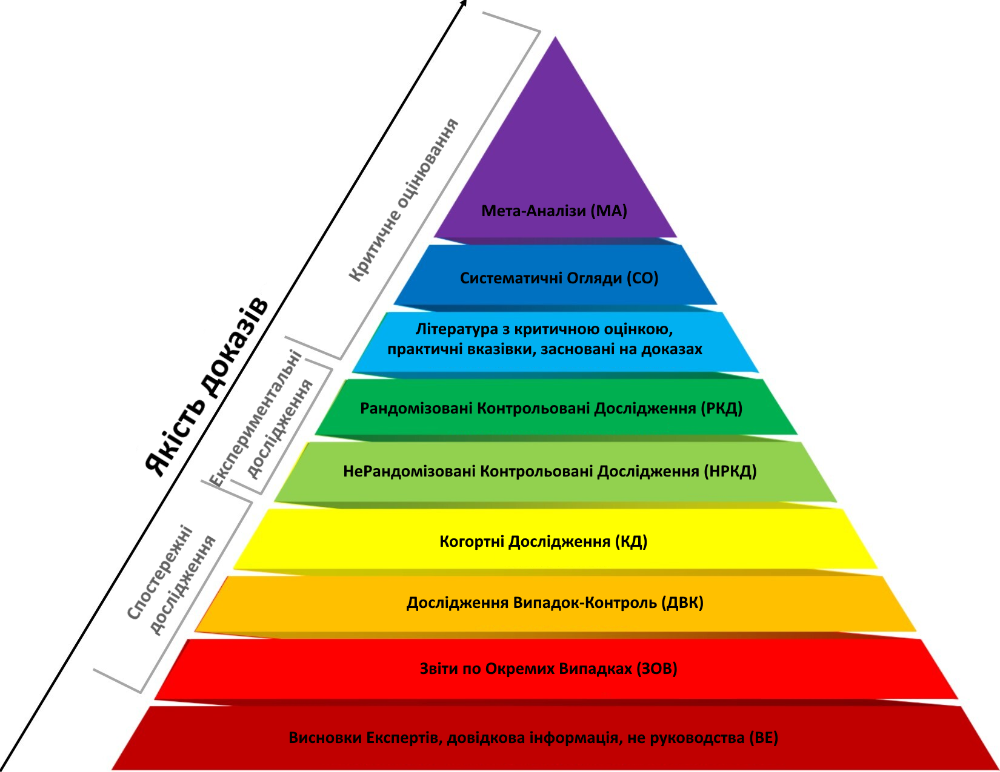

# Доказова медицина

## Чим важлива доказова медицина 

*Ще до недавнього часу лікарі з усього світу в питаннях діагностики та лікування опиралися виключно на власний досвід або ж на думки більш досвідченіших фахівців галузі. Переважання медицини, заснованої на авторитеті чи традиції, а не на доказах, – часто приводило до жахливих наслідків*.

Сучасний лікар у своїй практиці повинен керуватися головними принципами доказової медицини – тобто використовувати результати кращих клінічних досліджень для вибору лікування конкретного пацієнта та інтегрувати кращі наукові докази з індивідуальним клінічним досвідом і очікуваннями пацієнтів.

## Ієрархія доказів

Ієрархія доказів – це таксономія, яка організовує клінічні дослідження на основі дизайну дослідження та присвоює кожному дизайну рівень класифікації.

Ієрархія візуально зображується у вигляді піраміди, де найнижчої якості проекти досліджень мають найвищий ризик упередженості в нижній частині піраміди, а найякісніші дослідження з найнижчим ризиком упередженості у верхній частині.

## На що звернути увагу в ієрархії доказів

Нижче наведено інструкція, яка коротко описує побудову та раціональність рівнів ієрархії, переходячи від найвищого рівня доказовості до найнижчого:

1. СО і МА є найвищим рівнем доказовості. Ці дослідження оцінюють узгодженість результатів і ризик упередженості між усіма дослідженнями, що досліджують тему, і демонструють загальний ефект втручання або впливу серед цих досліджень.
2. РКД є другим за рівнем доказовості. Ці дослідження призначені для мінімізації змішаної упередженості та перевірки причинно-наслідкових зв'язків між групами щодо впливу втручання на результат.
3. Когортні обсерваційні дослідження (КД) є третім за рівнем доказовості. Як ретроспективні, так і когортні дослідження можуть бути схильні до різних упереджень. Проспективні когортні дослідження вважаються більш надійними і менш схильними до інформаційної упередженості (відбір, неправильна класифікація, пригадування і т.д.), і може бути встановлена тимчасовість зв'язку (результат слідує за експозицією). Плутанина з упередженістю можлива як у ретроспективних, так і в проспективних когортних дослідженнях і є серйозною проблемою, яка може зменшити достовірність результатів цих досліджень.
4. Дослідження випадок-контроль (ДВК), різновид обсерваційного дослідження, є четвертим за ступенем доказовості. Ці дослідження, як правило, є ретроспективними: результат вже настав, і дослідники намагаються з'ясувати, чи існує зв'язок між результатом і фактором впливу/ризику. Дослідження випадок-контроль схильні до упередженості відбору, упередженості інформації та упередженості, що збиває з пантелику, що в сукупності робить ці дослідження менш надійними, ніж когортні дослідження.
5. Серії випадків та звіти про випадки (ДВК і ЗОВ) є другим найнижчим рівнем доказовості і, по суті, є когортними дослідженнями, в яких відсутня контрольна група. Відсутність групи порівняння ускладнює можливість встановити зв'язок між досліджуваною змінною та наслідками втручання/впливу/фактора ризику та результатом.
6. Експертна думка (EO) є найнижчим рівнем доказовості, оскільки вона дуже схильна до упередженості. У порівнянні з усіма вищезазначеними рівнями доказів, експерти з більшою ймовірністю вибірково вибиратимуть докази, які підтверджують їхні попередні припущення чи переконання, можуть бути більш схильними до конфлікту інтересів і можуть бути настільки вибірково зосереджені на одній сфері, що втрачають з поля зору ширшу картину, яка упереджено впливає на їхню точку зору. До експертного висновку слід ставитися обережно і не обов'язково сприймати за чисту монету.
7. Дослідження на лабораторних тваринах слід розглядати як висування гіпотез, а не як остаточний доказ для прийняття клінічних рішень. Їх основна мета — визначити біологічну достовірність наступних клінічних досліджень.

## Переваги ієрархії доказів

Ієрархія забезпечує легку візуалізацію дизайну дослідження, що дає дослідникам і споживачам знань грубий метод для визначення того, скільки довіри слід вкласти в дослідження, засноване на дизайні дослідження по відношенню до інших типів досліджень у піраміді.

## Застереження ієрархії доказів

Ієрархія може бути занадто спрощеною, і її не слід використовувати для остаточного судження про цінність дослідження просто за його дизайном. Хоча систематичні огляди та мета-аналізи (SR/MA) знаходяться на вершині ієрархії та представляють найвищий рівень доказів, це не означає, що ці дослідження завжди вільні від методологічних проблем та упередженості.

Ця ж концепція застосовна до будь-якого пробного дизайну в піраміді. Подібним чином, хоча експертні висновки та звіти про клінічні випадки представляють найнижчий рівень доказів і найбільш схильні до упередженості, ці форми дослідження можуть надати обґрунтовану інформацію. Однак вони завжди матимуть обмеження, що робить їх найменш надійною формою доказів.

## Терміни

- **Рандомізоване контрольоване дослідження** - тип наукового експерименту, при якому його учасники у довільному порядку діляться на групи, в одній з яких проводиться досліджуване втручання, а в іншій (контрольній) застосовуються стандартні методики або плацебо
- **Лонгітюдне дослідження (панельне)** - це дизайн дослідження, який передбачає повторювані спостереження за одними і тими ж змінними (наприклад, людьми) протягом тривалих періодів часу (тобто з використанням лонгітюдних даних). Лонгітюдне дослідження являє собою комплексну методику вивчення певних ознак, властивостей випробовуваного об 'єкта протягом тривалого часу. Його назва походить від англійського слова longitude, що означає "довгота".
- **Когортне дослідження** - це особлива форма лонгітюдного дослідження, яка відбирає когорту (групу людей, які мають спільну характеристику, як правило, тих, хто пережив спільну подію у вибраний період, наприклад, народження або випуск), виконуючи поперечний зріз через певні проміжки часу. Це тип дослідження, де особи в групі мають спільну характеристику та повторні дослідження використовуют той самий розмір вибірки.

## Використані матеріали

- [What is the Hierarchy of Evidence?](https://www.researchsquare.com/blog/what-is-the-hierarchy-of-evidence)
