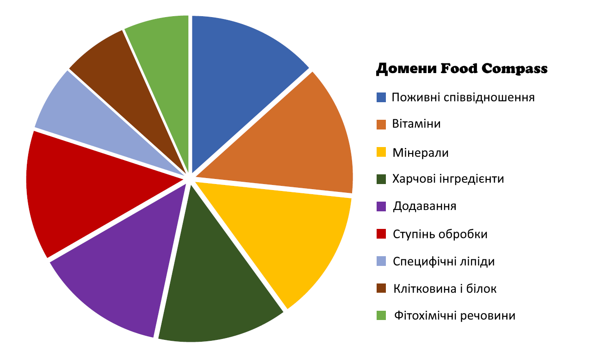
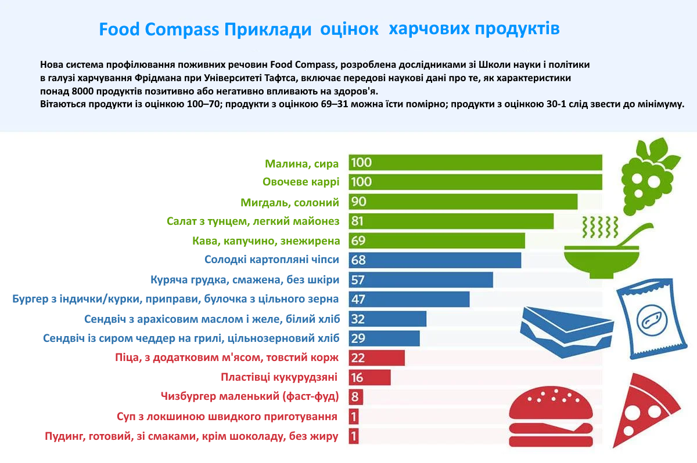

# Харчовий компас

## Про харчовий компас

"Як тільки ви виходите за рамки "їжте овочі, уникайте газованої води", громадськість досить спантеличена тим, як визначити більш здоровий вибір у продуктовому магазині, кафетерії та ресторані", - сказав провідний автор дослідження та автор-кореспондент Даріуш Мозаффарян, декан Школи Фрідмана. «Споживачі, політики та навіть промисловість шукають прості інструменти, які спрямують усіх до більш здорового вибору».

Харчовий компас (Food Compass) це система профілювання поживних речовин (NPS - Nutrient profiling systems), найбільш всеосяжна та науково обґрунтована на сьогоднішній день, усуває плутанину на користь споживачів, політиків.

Американські вчені Університету Тафтса проаналізували понад 8000 продуктів, напоїв і готових страв і склали своєрідний рейтинг їх корисності. Дослідники перевірили продукти за 54 характеристиками і впливом на розвиток хвороб: діабет, серцево-судинні захворювання та ожиріння. Ця інформація допоможе складати більш докладний опис для етикеток, визначати дієтичну цінність продукту і більш усвідомлено підходити до вибору харчування.

Food Compass був розроблений таким чином, щоб додаткові атрибути та оцінка могли розвиватися на основі майбутніх доказів у таких сферах, як здоров'я шлунково-кишкового тракту, імунна функція, здоров'я мозку, здоров'я кісток, а також фізична та розумова працездатність; а також міркування сталого розвитку.

## Особливості системи

Важливі особливості системи, включають:

- Однаково враховуючи здорові та шкідливі фактори в продуктах харчування (багато існуючих систем зосереджені на шкідливих факторах)
- Включення передових наукових досягнень щодо поживних речовин, харчових інгредієнтів, характеристик обробки, фітохімічних речовин та добавок (існуючі системи зосереджені в основному лише на кількох поживних речовинах)
- Об'єктивна оцінка всіх продуктів, напоїв і навіть змішаних страв і страв за допомогою однієї послідовної оцінки (існуючі системи суб'єктивно групують і оцінюють продукти по-різному).

Харчовий компас оцінює харчові продукти за дев’ятьма доменами, причому шість доменів мають однакову вагу, а три домени мають половинну вагу на основі більш скромного відносного впливу на здоров’я. Кожна оцінка домену обчислюється як середнє значення балів конкретних характеристик у цьому домені.

**Кожен продукт енергетично рівний 100 ккал (418,4 кДж) оцінюється за 54 окремими характеристиками, згрупованих по 9 доменах.
Оцінка характеристик на 100 ккал забезпечує більш порівнянну оцінку продуктів харчування та напоїв, ніж за вагою (оскільки включає воду) або розміром порції (сильно варіюється між продуктами).**

## Оцінки їжи

Кожна їжа, напій або змішана страва отримує остаточний бал Food Compass від 1 (найменш здоровий) до 100 (найздоровіший). Дослідники визначили 70 або більше балів як розумний бал для продуктів або напоїв, які слід заохочувати. Продукти та напої з балами 31-69 слід вживати в помірних кількостях. Все, що набрало 30 балів або нижче, слід споживати мінімально.

У основних категоріях продуктів харчування середній бал за Food Compass становив 43,2.

- Найнижчу категорію балів отримали снеки та солодкі десерти (середній бал 16,4).
- Найвищими категоріями балів були овочі (середній бал 69,1), фрукти (середній бал 73,9, майже всі сирі фрукти отримали 100 балів), а також бобові, горіхи та насіння (середній бал 78,6).
- Серед напоїв середній бал варіювався 
  - від 27,6 для підсолоджених цукром газованих напоїв та енергетичних напоїв
  - до 67 для 100% фруктових або овочевих соків
- Крохмалисті овочі набрали в середньому 43,2 бала.
- Середній бал за яловичину склав 24,9, для птиці – 42,67, а для морепродуктів – 67,0.

[Повний список продуктів](https://static-content.springer.com/esm/art%3A10.1038%2Fs43016-021-00381-y/MediaObjects/43016_2021_381_MOESM1_ESM.pdf) - PDF (en), Table 7. Food Compass Score, со стор. 24

## Клінічне застосування оцінки

- [Клінічне застосування оцінки харчового компаса: позитивний зв'язок з оцінкою середземноморської дієти, системою оцінки зірок здоров'я та раннім режимом харчування у студентів університетів](https://www.ncbi.nlm.nih.gov/pmc/articles/PMC9326537/)

  > Дане дослідження є першим застосуванням оцінки FCS з моменту її запуску в 2021 році. Його кореляція з HSR і MedDietScore і групами продуктів була правдоподібною, і це було пов'язано з кращими харчовими звичками, такими як ранній прийом їжі. «Головний меседж» полягає в тому, що наші результати вказують на потенційну корисність цього нового дієтичного індексу, принаймні для молодих людей. Тестування щодо результатів для здоров'я та застосування на більшій кількості груп населення може покращити використання FCS для керівництва поведінкою споживачів, а також для формування продовольчої політики та розробки нових продуктів у галузі.
  >
  > *HSR*: Рейтинг Health Star Rating
  > 
  > *MedDietScore*: комп'ютерна програма, яка оцінює дотримання середземноморської дієти та її зв'язок із ризиком серцево-судинних захворювань.

### Рейтинг Health Star Rating

Рейтинг Health Star Rating (HSR) - це добровільна система маркування на лицьовій стороні упаковки, яка оцінює загальний харчовий профіль упакованої їжі. Він присвоює оцінку від 1/2 зірки до 5 зірок на основі здоровості їжі.

Ось як це працює:

- *1/2 зірки*: вказує на менш здоровий вибір.
- *5 зірок*: представляє найздоровіший варіант.

Коли ви порівнюєте схожі упаковані продукти, шукайте найвищий рейтинг, щоб зробити більш здоровий вибір. Понад 10 300 упакованих продуктів наразі мають зірковий рейтинг здоров'я на своїй упаковці.

Пам'ятайте, що оцінка 3,5 зірки або вище, як правило, вважається здоровою. Тож наступного разу, коли ви будете робити покупки, слідкуйте за цими зірками!

### Cередземноморська дієта

Cередземноморська дієта включає в себе такі основні елементи:

- **Багато овочів і фруктів**: Вживання різноманітних овочів та фруктів, які забезпечують вітаміни, мінерали та антиоксиданти.
- **Оливкова олія**: Використання оливкової олії як основного джерела жирів.
- **Риба та морепродукти**: Регулярне вживання риби, особливо жирних сортів, таких як лосось та сардина.
- **Повільне приготування**: Віддача переваги традиційним методам приготування, таким як тушкування та запікання.
- **Обмеження червоного м’яса**: Зменшення споживання червоного м’яса та оброблених м’ясних продуктів.
- **Сир та йогурт**: Вживання нежирних сирів та йогурту.

## Використані матеріали

- [Food Compass | tufts.edu](https://sites.tufts.edu/foodcompass/)
- [Рейтинг корисності продуктів від першого до найгіршого | now.tufts.edu](https://now.tufts.edu/2021/10/14/ranking-healthfulness-foods-first-worst)
- [Food Compass is a nutrient profiling system | nature.com](https://www.nature.com/articles/s43016-021-00381-y.epdf?sharing_token=rXE-EUQhF_ewQyjads3RTtRgN0jAjWel9jnR3ZoTv0PPFX4_UgkV63y9Env4jkUDyrBA_9kG-Lxz6QgkvVdmMKBlJ7k8y7v30cRFyRNAydxlY5YNATNy6EWMVYTeCU4NpFXpSNA6XuOIH9vjNYTOYkuaOA7QRr1Af7rKzgFOzDs%3D)
- [Food Compass (PDF); Table 7. Food Compass Score, со стор. 24](https://static-content.springer.com/esm/art%3A10.1038%2Fs43016-021-00381-y/MediaObjects/43016_2021_381_MOESM1_ESM.pdf)
- [Названо найкорисніші продукти для здоров'я і ті, які їсти взагалі не варто | obozrevatel.com](https://food.obozrevatel.com/ukr/news/nazvano-najkorisnishi-produkti-dlya-zdorovya-i-ti-yaki-isti-vzagali-ne-varto.htm)
- [Харчовий компас: що це таке, і як він допомагає орієнтуватися в правильному харчуванні? | suntimes.com.ua](https://suntimes.com.ua/sport/kharchovij-kompas-shcho-tse-take-i-yak-vin-dopomagae-orientuvatisya-v-pravilnomu-kharchuvanni.html)