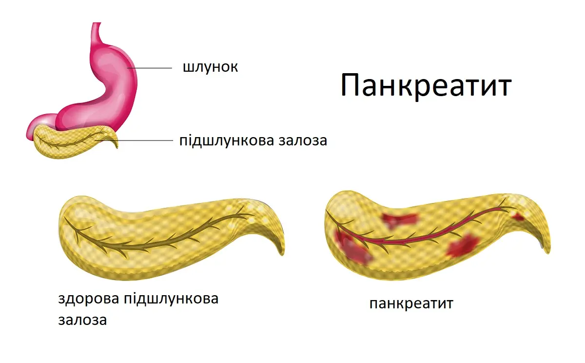

# Панкреатит

## Що таке панкреатит?

Панкреатит - це захворювання, при якому запалюється підшлункова залоза.

Підшлункова залоза - це велика залоза позаду шлунка і поруч з тонкою кишкою. Ваша підшлункова залоза робить дві основні речі:

- вона вивільняє потужні травні ферменти в тонкий кишечник.
- вона вивільняє інсулін і глюкагон у кров. Ці гормони допомагають вашому організму контролювати, як він використовує їжу для отримання енергії.

При панкреатиті підшлункова залоза запалюється і пошкоджується власними хімічними речовинами травлення. Це може призвести до набряку і відмирання тканин підшлункової залози.

## Які бувають види панкреатиту?

Дві форми панкреатиту - гостра і хронічна.

### Гострий панкреатит

Гострий панкреатит – це раптове запалення, яке триває недовго. Він може варіюватися від легкого дискомфорту до важкого, небезпечного для життя захворювання. Більшість людей, які мають його, повністю одужують після отримання правильного лікування. У важких випадках гострий панкреатит може викликати кровотечу, серйозне пошкодження тканин, інфекцію і кісти. Важкий панкреатит також може завдати шкоди іншим життєво важливим органам, таким як серце, легені та нирки.

### Хронічний панкреатит

Хронічний панкреатит – це тривале запалення. Найчастіше це відбувається після епізоду гострого панкреатиту. Ще однією основною причиною є вживання великої кількості алкоголю протягом тривалого періоду часу. Пошкодження підшлункової залози від надмірного вживання алкоголю може не викликати симптомів протягом багатьох років, але потім у вас можуть раптово з'явитися важкі симптоми панкреатиту.

## Які симптоми панкреатиту?

Симптоми гострого панкреатиту:

- Помірний або важкий біль у верхній частині живота, що переходить у спину. Вживання їжі може погіршити ситуацію, особливо продукти з високим вмістом жиру.
- Лихоманка
- Вища частота серцевих скорочень
- Нудота і блювання
- Здуття і болючість в животі

Симптоми хронічного панкреатиту схожі з такими як при гострій формі, але у вас також можуть бути:

- Постійний біль у верхній частині живота, що віддає в спину. Цей біль може призвести до інвалідизації.
- Діарея та втрата ваги, тому що ваша підшлункова залоза не виділяє достатньо ферментів для розщеплення їжі
- Розлад шлунка і блювота
- Жирний, жирний стілець, який особливо неприємно пахне і залишає плівку в унітазі

## Локалізація болю при панкреатиті

Біль при панкреатиті зазвичай починається у верхній середній або лівій частині живота і може поширюватися на спину або вгору по лівій лопатці. Може здаватися, що він проникає глибоко у ваше тіло. Зазвичай він виникає раптово, а потім неухильно погіршується, і може тривати кілька днів.

Певні положення тіла або види діяльності також можуть впливати на біль. Ви можете почуватися гірше, якщо ви:

- лягаєте рівно на спину
- кашляєте
- робите вправи

Це може допомогти:

- сядьте прямо
- нахиліться вперед
- згорнутися в клубок

## Причини панкреатиту

До причин гострого панкреатиту відносяться:

- Вживання великої кількості алкоголю
- Камені в жовчному міхурі
- Аутоімунні захворювання
- Інфекцій
- Ліки
- Порушення обміну речовин
- Хірургія
- Травми області живота

У 15% людей з цим типом причина невідома.

До причин хронічного панкреатиту відносяться:

- Муковісцидоз
- Сімейний анамнез захворювань підшлункової залози
- Камені в жовчному міхурі
- Високий рівень тригліцеридів
- Тривале вживання алкоголю
- Ліки

Приблизно в 20-30% випадків причина хронічного панкреатиту невідома. Люди з цим типом зазвичай чоловіки у віці від 30 до 40 років. Афроамериканці частіше хворіють на панкреатит, ніж інші расові групи в США.

## Фактори ризику панкреатиту

Кілька речей можуть призвести до того, що у вас буде більше шансів мати цей стан, зокрема:

- Пияцтво (чотири і більше алкогольних напоїв на день)
- Куріння та вейпінг
- Ожиріння (ІМТ 30 або вище), особливо якщо ваша вага в основному знаходиться в районі живота
- Діабет
- Високий рівень тригліцеридів
- Наявність панкреатиту в сімейному анамнезі

## Чи може панкреатит викликати ускладнення?

Цей стан може мати важкі ускладнення, серед яких:

- Діабет, якщо є пошкодження клітин, які виробляють інсулін
- Інфекція підшлункової залози
- Ниркова недостатність
- Втрата ваги
- Недоїдання, якщо ваш організм не може отримувати достатню кількість поживних речовин з їжі, яку ви їсте, через нестачу травних ферментів
- Закупорка жовчних проток
- Панкреонекроз, коли тканини відмирають, тому що підшлункова залоза не отримує достатньої кількості крові
- Проблеми з диханням, коли хімічні зміни в організмі впливають на легені
- Псевдокісти, коли рідина збирається в кишенях на підшлунковій залозі. Вони можуть лопнути і заразитися.
- Рак підшлункової залози

## Як діагностується панкреатит?

Щоб перевірити наявність гострого панкреатиту, лікар, ймовірно, натисне на ваш живіт, щоб побачити, чи він болючий, і перевірить низький кров'яний тиск, низьку температуру та прискорений пульс.

Щоб поставити діагноз, лікар проведе аналіз крові на визначення двох травних ферментів: амілази та ліпази. Високий рівень цих двох ферментів означає, що у вас, ймовірно, гострий панкреатит. Вони також перевірять вашу кров на лейкоцити, рівень цукру в крові, кальцій і функцію печінки.

Щоб діагностувати хронічний панкреатит, рентген або візуалізаційні тести, такі як КТ або МРТ, можуть показати, чи кальцифікована підшлункова залоза. Ваш лікар візьме зразки крові та перевірить ваш стілець на наявність надлишку жиру, що є ознакою того, що підшлункова залоза більше не виробляє достатньо ферментів для переробки жиру. Вам можуть призначити тест функції підшлункової залози, щоб побачити, наскільки добре підшлункова залоза виділяє травні ферменти. Вас також можуть перевірити на наявність діабету.

Інші тести можуть включати:

- УЗД, КТ та МРТ, які роблять зображення вашої підшлункової залози, щоб показати ступінь запалення, такі причини, як проблеми з жовчними протоками та камені в жовчному міхурі, для таких ускладнень, як кісти
- ЕРХПГ (Ендоскопічна Ретроградна ХолангіоПанкреатоГрафія), при якій лікар використовує довгу трубку з камерою на кінці, щоб подивитися на вашу підшлункову залозу і жовчні протоки
- Біопсія, під час якої лікар використовує голку, щоб видалити невеликий шматочок тканини з підшлункової залози для дослідження
- У деяких випадках лікар може перевірити вашу кров і кал, щоб підтвердити діагноз. Вони також можуть провести тест на толерантність до глюкози, щоб виміряти пошкодження клітин підшлункової залози, які виробляють інсулін.

## Як лікується панкреатит?

### Лікування гострого панкреатиту

Якщо у вас стався напад гострого панкреатиту, ви можете отримати сильні препарати від болю. Можливо, вам доведеться дренувати шлунок через трубку, введену через ніс. Якщо напад тривалий, вас можуть годувати і зволожувати внутрішньовенно (через вену).

Ймовірно, вам доведеться залишитися в лікарні, де ваше лікування може включати:

- Антибіотики, якщо ваша підшлункова залоза інфікована
- Внутрішньовенні (в/в) рідини, що вводяться через голку
- Дієта з низьким вмістом жирів або голодування. Можливо, вам доведеться припинити їсти, щоб ваша підшлункова залоза могла відновитися. У цьому випадку ви будете отримувати харчування через зонд для годування.
- Ліки від болю

Якщо ваш випадок більш серйозний, ваше лікування може включати:

- Ендоскопічна ретроградна холангіопанкреатографія (ЕРХПГ), процедура, яка передбачає введення трубки через горло в шлунок і верхні відділи кишечника для видалення каменів у жовчному міхурі, якщо вони блокують жовчні або панкреатичні протоки. Для видалення каменів у жовчній протоці роблять невеликий надріз або вставляють у протоки пластикову трубку, яка називається стентом, щоб полегшити непрохідність.
- Операція на жовчному міхурі, якщо камені в жовчному міхурі викликали панкреатит
- Операція на підшлунковій залозі для очищення від рідини, відмерлих або хворих тканин

### Лікування хронічного панкреатиту

Якщо у вас цей тип, ваш лікар зосередиться на лікуванні болю, захищаючи від можливої залежності від рецептурних знеболюючих. Вони також спостерігатимуть за ускладненнями, які впливають на травлення. Вам можуть призначити замісну терапію ферментами підшлункової залози, щоб відновити здатність травного тракту перетравлювати поживні речовини; Це також, ймовірно, зменшить частоту нових атак.

Вам може знадобитися:

- Інсулін для лікування цукрового діабету
- Ліки від болю
- Ферменти підшлункової залози, які допоможуть вашому організму отримувати достатню кількість поживних речовин з їжі
- Хірургічне втручання або процедури для полегшення болю, допомоги з дренажем або лікування закупорки
- Ін'єкція анестетиків в нерви біля хребта може дати полегшення болю. Якщо біль не реагує на ліки або блокади нервів, лікар може використовувати хірургічне втручання для видалення пошкодженої тканини підшлункової залози, але тільки в крайньому випадку.

## Як запобігти панкреатиту?

Оскільки багато випадків панкреатиту викликані зловживанням алкоголем, профілактика часто зосереджена на обмеженні того, скільки ви п'єте або не п'єте взагалі. Якщо ваше вживання алкоголю викликає занепокоєння, поговоріть зі своїм лікарем або медичним працівником про центр лікування алкоголізму. Група підтримки, така як Анонімні Алкоголіки, також може допомогти.

Інші речі, які ви можете зробити, щоб зменшити свої шанси на це захворювання, включають відмову від куріння, дотримання порад лікаря та дієтолога щодо вашої дієти та прийом будь-яких ліків, призначених вашим лікарем.

## Висновки

Панкреатит - це хворобливий стан, який виникає, коли підшлункова залоза запалюється. Два основних типи – гострий, який виникає раптово, і хронічний, який є тривалим. Основними факторами ризику є постійне надмірне вживання алкоголю та камені в жовчному міхурі, хоча інші речі можуть відігравати певну роль, наприклад, сімейний анамнез, травми підшлункової залози та інфекції, серед інших. 

Хвороба добре піддається лікуванню, але ускладнення можуть бути небезпечними для життя, тому рання діагностика та лікування мають вирішальне значення для одужання. Вживання алкоголю є одним з основних факторів ризику, тому обмеження того, скільки ви п'єте, або не п'єте взагалі, є ключем до його запобігання.

## Використані матеріали

- [Pancreatitis | webmd.com](https://www.webmd.com/digestive-disorders/digestive-diseases-pancreatitis)