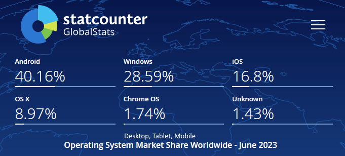
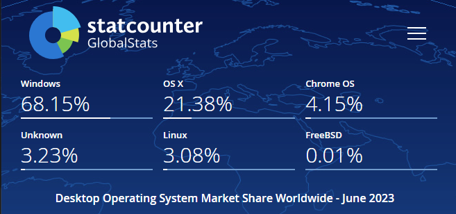

import OsSvg from './assets/os.svg'

# Операційні системи 

## Загальні відомості

<table>
<tr>
  <td> <OsSvg /> </td>
  <td> 
Операці́йна систе́ма, скорочено ОС (англ. operating system, OS) - 
це базовий комплекс програм, що виконує керування апаратною складовою комп'ютера
або віртуальної машини; забезпечує керування обчислювальним процесом
і організовує взаємодію з користувачем.

Операційна система звичайно складається з ядра операційної системи
та базового набору прикладних програм.
  </td>
</tr>
</table>

- [Операційна система wikipedia.org — wikipedia.org]
(https:/uk.wikipedia.org/wiki/Операційна_система)

## Статистика використання

### Linux та Windows

- [Порівняння статистики використання Linux і Windows для веб-сайтів — w3techs.com]
(https://w3techs.com/technologies/comparison/os-linux,os-windows)

### ОС на пристроях 

### ОС на настільних ПК

