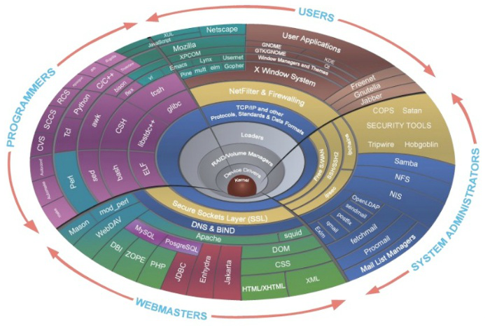
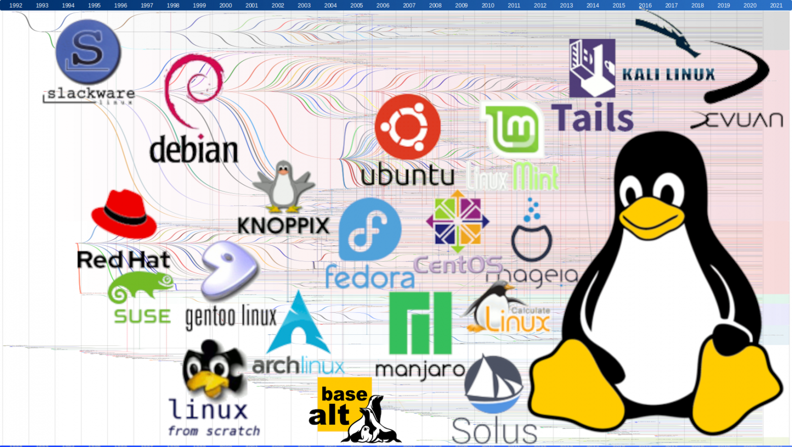
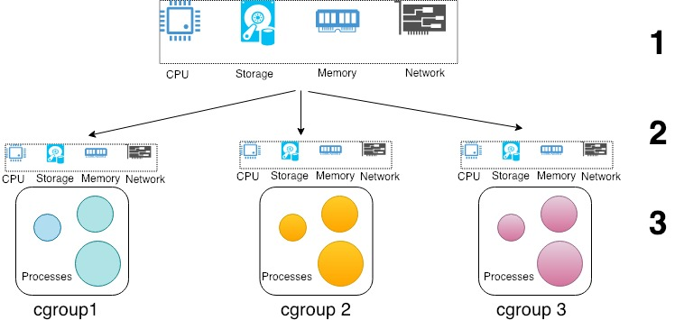

# Linux

## Загальні відомості

Linux - сімейство Unix-подібних операційних систем на базі ядра Linux, що включають той чи інший набір утиліт і програм GNU проекту, і, можливо, інші компоненти. Як і ядро Linux, системи на його основі, як правило, створюються та поширюються відповідно до моделі розробки вільного та відкритого програмного забезпечення. Linux-системи поширюються в основному безкоштовно у вигляді різних дистрибутивів - у формі, готової для встановлення та зручної для супроводу та оновлень, - і мають свій набір системних та прикладних компонентів, як вільних, так і пропрієтарних (власницьких).

- [Уроки по Linux — acode.com.ua](https://acode.com.ua/linux-lessons/)
- [Путівник по Linux — linuxguide.rozh2sch.org.ua](https://linuxguide.rozh2sch.org.ua/)
- [Онлайн-курс з лінукс — geek-university.com](https://geek-university.com/linux-online-course/) - це освітній веб-сайт, що пропонує багато безкоштовних комп'ютерних онлайн-курсів.

## Ядро Linux

Ядро Linux (Linux Kernel) – це основний компонент операційної системи, що є центром цієї системи, довкола якого все і будується. Ядро Linux координує всі дії між апаратною частиною комп'ютера та всіма компонентами операційної системи, включаючи програми. Таким чином, ядро Linux - це база, та основа, на якій і побудована операційна система Linux.

Ядро операційної системи відповідає за її базові команди та операції, які вона вміє робити:

- управління пам'яттю - виділити місце програмі, обмежити, очистити;
- управління процесами - запустити, дати ресурси, вбити;
- керування залізом - в ядро вбудовані драйвери для деякого набору обладнання, щоб  операційна система відразу працювала на залозі;
- обмін інформацією між процесами, службами та програмами – щоб програми могли надсилати запити в інтернет, писати дані на диск, читати з диска, запускати один одного, звертатися до системи тощо.

- [Ядро Linux. Версии ядра Linux](https://ravesli.com/linux-kernel/)
- [Linux 6.4: новые возможности ядра — habr.com | 2023.06](https://habr.com/ru/companies/selectel/articles/744356/)



## Дистрибутиви Linux

Дистрибутив Linux (часто скорочено дистрибутив або дистро) - це операційна система, створена з набору програмного забезпечення, що включає ядро Linux і часто систему керування пакетами. Користувачі Linux зазвичай отримують свою операційну систему, завантажуючи один з дистрибутивів Linux, які доступні для різних систем, починаючи від вбудованих пристроїв (наприклад, OpenWrt) і персональних комп'ютерів (наприклад, Linux Mint) і закінчуючи потужними суперкомп'ютерами (наприклад, Rocks Cluster Distribution).

Типовий дистрибутив Linux включає (зазвичай модифіковане) ядро Linux, систему ініціалізації (таку як systemd, OpenRC або runit), інструменти та бібліотеки GNU, документацію та багато інших програм (наприклад, утиліти налаштування IP-мережі та програму встановлення TTY getty). Опціонально, щоб забезпечити можливості робочого столу (найчастіше графічні драйвери користувальницького простору Mesa) сервер відображення (найпоширенішим з яких є X.org Server або останнім часом компонувальник Wayland, такий як Sway, KWin KDE або Mutter з GNOME), середовище робітника столу, звуковий сервер (зазвичай або PulseAudio, або, останнім часом, PipeWire) та інші пов'язані програми можуть бути включені в дистрибутив або встановлюватись користувачем.

Більшість включеного програмного забезпечення є безкоштовним, а програмне забезпечення з відкритим вихідним кодом доступне як у вигляді скомпілованих двійкових файлів, так і у формі вихідного коду, що дозволяє вносити зміни до вихідного програмного забезпечення. Зазвичай дистрибутиви Linux додатково включають деяке пропрієтарне програмне забезпечення, яке може бути недоступне у вигляді вихідного коду, наприклад, бінарні BLOB-об'єкти, необхідні для деяких драйверів пристроїв.

Дистрибутив Linux також може бути описаний як певний набір прикладного та службового програмного забезпечення (наприклад, різних інструментів та бібліотек GNU), запакованого з ядром Linux таким чином, що його можливості задовольняють потреби багатьох користувачів. Програмне забезпечення зазвичай адаптується до дистрибутива, а потім його супроводжуючі об'єднують у програмні пакети. Пакети програмного забезпечення доступні онлайн у репозиторіях, які зазвичай розподіляються по всьому світу.Крім «клейових» компонентів, таких як установники дистрибутива (наприклад, Debian-Installer і Anaconda) і системи управління пакетами, дуже небагато пакетів насправді написані супроводжуючими дистрибутива.

- [Топ 5 стабильных дистрибутивов Linux — tecadmin.net | 2023.03](https://tecadmin.net/best-stable-linux-distributions/)
- [31 популярный дистрибутив Linux — stackscale.com | 2023.06](https://www.stackscale.com/blog/popular-linux-distributions/)
- [Какой Linux выбрать? Плюсы и минусы разных дистрибутивов](https://pc.ru/articles/best-linux-distros)



## Ubuntu

[Ubuntu](https://ubuntu.com/) підходить для розробників, професіоналів та студентів.

[Ubuntu for desktops](https://ubuntu.com/desktop) - настільна операційна система Ubuntu з відкритим вихідним кодом використовується на мільйонах ПК та ноутбуків по всьому світу. Незалежно від того, чи є ви розробником мобільних додатків, технічним менеджером, редактором музики чи відео чи фінансовим аналітиком з великомасштабними моделями для запуску – фактично, будь-кому, кому потрібна потужна машина для вашої роботи – Ubuntu – ідеальна платформа.

[Ubuntu на WSL](https://ubuntu.com/wsl) - повне термінальне середовище Ubuntu за лічені хвилини у Windows 10+ із підсистемою Windows для Linux (WSL). Доступ до терміналу Linux у Windows, розробка кросплатформових програм та керування ІТ-інфраструктурою, не виходячи з Windows.


## Репозиторії Ubuntu

Програми та оновлення в Ubuntu встановлюються переважно з репозиторіїв.

Репозиторії – це спеціальні сервери-сховища таких файлів. Їх також можна назвати «Джерелями додатків». Користувацькі комп'ютери підключаються до репозиторій через мережу або через інтернет і за допомогою спеціальних утиліт (таких як Synaptic) дозволяють Вам побачити, які пакети у Вас встановлені, які доступні для встановлення. Більшість утиліт підтримують простий пошук за ключовими словами і здатні розбивати групи пакетів за категоріями.

У Ubuntu все програмне забезпечення ділиться на чотири секції, які називають компонентами, щоб відобразити різницю в ліцензії та рівні доступної підтримки.

Пакети розподіляються за компонентами таким чином:

- **Main** – вільне ПЗ, яке офіційно підтримує компанія Canonical.
- **Restricted** – пропрієтарне ПЗ (в основному драйвери пристроїв), яке офіційно підтримує компанія Canonical.
- **Universe** – вільне ПЗ, яке офіційно не підтримується компанією Canonical (але підтримується спільнотою користувачів).
- **Multiverse** – пропрієтарне програмне забезпечення, яке не підтримується компанією Canonical.

Існує чотири основні репозиторії Ubuntu.

- **$release** – це пакети на момент виходу релізу.
- **$release-security** – пакети критичних оновлень безпеки.
- **$release-updates** – пакети оновлення системи (тобто пізніші версії ПЗ, що вже вийшли - після релізу).
- **$release-backports** – бекпорти нових версій деякого ПЗ, яке доступне тільки в нестабільних версіях Ubuntu.
- **partner** – репозиторій, що містить ПЗ компаній-партнерів Canonical.

Крім офіційних, існує безліч репозиторіїв від авторів програм і від тих, хто не полінувався зібрати з вихідних пакет і поділитися ним з іншими. Launchpad пропонує створювати PPA-репозиторії - [Personal Package Archive](https://help.ubuntu.ru/wiki/ppa), зазвичай невеликий репозиторій, в який його господар складає вихідні коди, а користувачі на виході отримують вже готовий deb-пакет.

Системний список репозиторіїв міститься у файлі /etc/apt/sources.list. Щоб додати репозиторій - відредагуйте цей файл, наприклад так:

```bash
sudo nano /etc/apt/sources.list
```

- [Репозиторії - help.ubuntu.ru](https://help.ubuntu.ru/wiki/репозиторий)

## Linux groups

cgroups (скорочено від control groups, групи управління) - це функція ядра Linux, яка обмежує, враховує та ізолює використання ресурсів (ЦП, пам'ять, дискове введення-виведення, мережу тощо) колекцією процесів.


