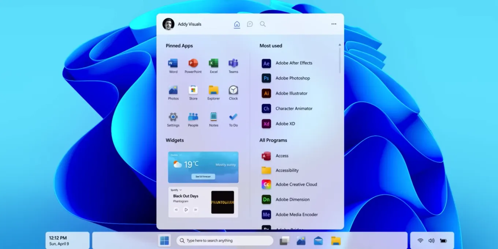

# Windows

## Загальні відомості

- [Microsoft Windows — wikipedia.org](https://uk.wikipedia.org/wiki/Microsoft_Windows)
- [Windows — microsoft.com](https://www.microsoft.com/uk-ua/windows)
- [Заметки о Windows и других программных продуктах Microsoft — windowsnotes.ru](https://windowsnotes.ru/)
- [Desktop Windows Version Market Share Worldwide — gs.statcounter.com](https://gs.statcounter.com/windows-version-market-share/)

## Вирішення проблем

- [Windows 11, все инструкции — remontka.pro](https://remontka.pro/windows-11-page/)
- [Windows 10, все инструкции — remontka.pro](https://remontka.pro/windows-10-page/)
- [Windows, список инструкций — remontka.pro](https://remontka.pro/windows-page/)

## Cистемні інструменти

### Вбудовані

- [Терминал Windows — github.com](https://github.com/microsoft/terminal) - це сучасний, швидкий, потужний та ефективний додаток терміналу для користувачів засобів командного рядка та оболонок, таких як Командний рядок, PowerShell та WSL. До його основних функцій входять множинні вкладки, панелі, підтримка символів Юнікоду та UTF-8, модуль відтворення тексту з використанням графічного прискорювача, а також теми користувача, стилі та конфігурації.
- [Средства Windows/Администрирование — learn.microsoft.com](https://learn.microsoft.com/ru-ru/windows/client-management/client-tools/administrative-tools-in-windows)
- [Встроенные системные утилиты Windows, о которых полезно знать — remontka.pro](https://remontka.pro/system-utilities-windows/)
- [15 Best Hidden System Tools in Windows — thepcinsider.com](https://www.thepcinsider.com/best-hidden-system-tools-windows/)
- [Guide To Windows 10 System Tools — alphr.com](https://www.alphr.com/windows-10-system-tools/)

### Додаткові

- [System Tools by categories — majorgeeks.com](https://www.majorgeeks.com/mg/sortname/system_tools.html)
- [11 Best Free System Information Tools — lifewire.com](https://www.lifewire.com/free-system-information-tools-2625772)
- [CCleaner — ccleaner.com](https://www.ccleaner.com/ru-ru) - програма для догляду за системою. Вона видаляє невикористовувані файли, дозволяючи ОС працювати швидше і звільняючи місце на жорстких дисках

### Командна оболонка

У Windows є дві оболонки командного рядка: командна оболонка та PowerShell.

- [Команды Windows — learn.microsoft.com](https://learn.microsoft.com/ru-ru/windows-server/administration/windows-commands/windows-commands)
- [PowerShell Core](https://docs.microsoft.com/ru-ru/powershell/) — это кроссплатформенный (Windows, Linux и macOS) инструмент/среда для автоматизации и настройки, который хорошо работает с существующими инструментами и оптимизирован для работы со структурированными данными (например, JSON, CSV, XML и т. Д.), API-интерфейсами REST и объектными моделями. Он включает оболочку командной строки, связанный язык сценариев и инфраструктуру для обработки командлетов.
- [Что такое Терминал Windows? — learn.microsoft.com](https://learn.microsoft.com/ru-ru/windows/terminal/)
- [Windows Terminal — загрузка, настройка, использование — remontka.pro](https://remontka.pro/windows-terminal/)

**Виклик**

1. `Win + R` та ввести `cmd`
2. Через меню по `Win + X`
3. Через [Терминал Windows — github.com](https://github.com/microsoft/terminal), до якого підключаються необхідні оболонки 

**Варіанти створення файлу**

- `type null > file1.txt`
- `copy con file2.txt` - вводиться потрібний текст і завершується за Ctrl + Z
- `echo "Ваш текст тут" > file3.txt`
- `fsutil file createnew file4.txt 1000` - створюється файл рамером 1000 байт (бінарний)

## Linux на Windows

Підсистема Windows для Linux (WSL) дозволяє розробникам запускати середовище GNU/Linux - включаючи більшість інструментів командного рядка, службових програм та додатків - безпосередньо у Windows без змін, без додаткових витрат на традиційну віртуальну машину або інсталяцію з подвійним завантаженням.

- [Документация по подсистеме Windows для Linux — learn.microsoft.com](https://learn.microsoft.com/ru-ru/windows/wsl/)
- [Установка Linux на Windows с помощью WSL — learn.microsoft.com](https://learn.microsoft.com/ru-ru/windows/wsl/install)

 

