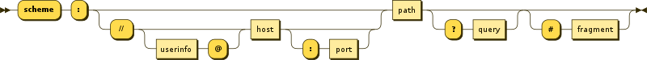
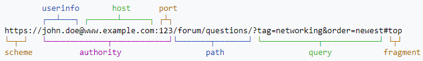
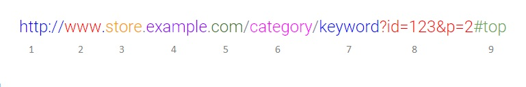
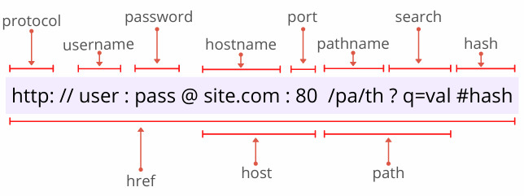

# Веб. Базові поняття 

## Web

Веб або всесвітня павутина (World Wide Web, Web, WWW) - це розподілена система, що надає доступ до пов'язаних між собою документів та інших ресурсів, розташованих на різних комп'ютерах, підключених до мережі Інтернет, а також до онлайн послуг.

## URI та URL 

URI - уніфіко́ваний ідентифіка́тор ресу́рсів (англ. Uniform Resource Identifier, URI) — компактний рядок літер, який однозначно ідентифікує окремий абстрактний чи фізичний ресурс. Основне призначення таких ідентифікаторів — зробити можливою взаємодію з поданнями ресурсів через мережу, переважно Всесвітнє павутиння, використовуючи спеціальні протоколи. URI визначається схемами, які визначають синтаксис та відповідні протоколи.

Загальний синтаксис URI складається з п'яти компонентів, організованих ієрархічно в порядку зменшення значимості зліва направо:
> URI = scheme ":" ["//" authority] path ["?" query] ["#" fragment]

Компонент **authority** складається з підкомпонентів:
> authority = [userinfo "@"] host [":" port]

Найпоширенішою формою URI є уніфікований локатор ресурсів (URL, Uniform Resource Locator), який неофіційно називають веб-адресою.

Кожен із ресурсів може бути доступний через URL. URL включає явно або мається на увазі неявно стандартизований протокол доступу до ресурсу, наприклад, `http`. `https`, `ftp`.

Доменне ім'я — символьне ім'я, що служить для ідентифікації областей, які є одиницями адміністративної автономії в мережі Інтернет, у складі такої області, що стоїть за ієрархією. Кожна з таких областей називається доменом.

1. Протокол
2. Префікс `www` зазвичай може бути відсутнім
3. Субдомен (subdomain, піддомен) - це частина домену нижчого рівня
4. Домен (Root Domain) — зазвичай назва вашого бренду, компанії
5. Доменна зона (Top-Level Domain, TLD), суфікс доменного імені:
  > - 2-й рівень - найвищий (.ua, .gov)
  > - 3-й рівень (.net.ua, .com.ua, org.ua)

  > Існує поділ усіх доменних зон на:
  > - Регіональні, коли двома символами позначається код країни (2-й рівень), а всередині країни – регіон (3-й рівень). > ISO коди країн можна знайти за цим посиланням.
  > – Тематичні суфікси, існують дуже давно. Приклади:
  >   - .com - комерційна тематика
  >   - .net - компанії операторів зв'язку, провайдерів і т.п. Словом, Мережа.
  >   - .org - різні некомерційні організації  
6. Сегмент директорії або шляху (Subfolder/Path)
7. Сегмент директорії або шляху (Subfolder/Path). Останній сегмент часто називають як слаг (slug)
8. Параметри запросу
9. Фрагмент - позначене на сторінці іменоване розташування (якір). Здійснюється перехід до заданого місця на сторінці.

:::info Доменне ім'я
Разом частини 3, 4 та 5 утворюють Доменне ім'я. На сленгу Інтернет-маркетологів воно часто називається "Морда".
:::

:::info Слаг у URL-адреси 
Слаг у URL-адреси (також відомий як злаг веб-сайту) — це останній сегмент шляху URL-адреси, який є унікальним ідентифікатором сторінки.
:::

  
Поточна URL-адреса в JavaScript

Якщо ви використовуєте JavaScript у браузері, ви можете отримати повну поточну URL-адресу за допомогою `window.location.href`, де `window.location` є об'єктом URL. Об'єкт URL дозволяє розбирати URL-адресу на компоненти.

Властивості об'єкта URL:
<ul>
<li><b>URL.hash</b> - хеш URL адреси</li>
<li><b>URL.host</b> - хост URL адреси</li>
<li><b>URL.hostname</b> - хост і домен URL адреси</li>
<li><b>URL.href</b> - містить повну URL адресу</li>
<li><b>URL.origin</b> - протокол, ім'я домену і номер порта URL адреси</li>
<li><b>URL.password</b> - пароль користувача вказане у URL</li>
<li><b>URL.pathname</b> - шлях URL-адреси</li>
<li><b>URL.port</b> - порт URL-адреси</li>
<li><b>URL.protocol</b> - протокол URL-адреси</li>
<li><b>URL.search</b> - параметри URL-адреси</li>
<li><b>URL.searchParams</b> - об'єкт URLSearchParams</li>
<li><b>URL.username</b> - ім'я користувача вказане в URL</li>
</ul>

## Браузер

Бра́узер, також бравзер, переглядач, вебпереглядач, вебоглядач, вебнавігатор (англ. browser) — програмне забезпечення для комп'ютера або іншого електронного пристрою, як правило, під'єднаного до Інтернету, що дає можливість користувачеві взаємодіяти з текстом, малюнками або іншою інформацією на гіпертекстовій веб-сторінці.

Тексти та малюнки можуть містити посилання на інші вебсторінки, розташовані на тому ж вебсайті або на інших вебсайтах. Вебпереглядач з допомогою гіперпосилань дозволяє користувачеві швидко та просто отримувати інформацію, розміщену на багатьох вебсторінках.

Популярні браузери: **Google Chrome**, **Mozilla Firefox**, **Microsoft Edge**, **Opera**, **Safari**.

Частка ринку (популярність) браузерів різна для різних пристроїв та операційних систем на них.

- [Доля рынка топ браузеров — similarweb.com](https://www.similarweb.com/ru/browsers/)
- [ТОП-10 Лучших Браузеров 2023 года для Windows — all-browsers.com](https://all-browsers.com/best-browsers/)
- [Популярные браузеры в Украине в 2023 году — unian.net](https://www.unian.net/techno/sostavlen-reyting-samyh-populyarnyh-brauzerov-v-ukraine-v-2023-godu-12280569.html)

## HTML & CSS & JavaScript

Всесвітня павутина нерозривно пов'язана з поняттями гіпертексту та гіперпосилання. Більшість інформації в Інтернеті є саме гіпертекст.

Для створення, зберігання та відображення гіпертексту у Всесвітньому павутинні традиційно використовується мова [**HTML**](/docs/сoding-languages/html5+css3.md) (англ. HyperText Markup Language «мова розмітки гіпертексту»). Робота зі створення (розмітці) гіпертекстових документів називається версткою, вона робиться веб-майстром або окремим фахівцем з розмітки - верстальником. Після HTML-розмітки документ, що вийшов, зберігається у файл, і такі HTML-файли є основним типом ресурсів Всесвітньої павутини. Після того, як HTML-файл стає доступним веб-серверу, його починають називати веб-сторінкою. Набір веб-сторінок утворює веб-сайт.

Гіпертекст веб-сторінок містить гіперпосилання. Гіперпосилання допомагають користувачам Всесвітньої павутини легко переміщатися між ресурсами незалежно від того, чи знаходяться ресурси на локальному комп'ютері або на віддаленому сервері.

Для покращення візуального сприйняття вебу використовується технологія [**CSS**](/docs/сoding-languages/html5+css3.md), яка дозволяє задавати єдині стилі оформлення для багатьох веб-сторінок.

Для надання інтерактивності веб-сторінкам у браузері широко використовується мова програмування [**JavaScript**](/docs/сoding-languages/js-ts.md).

