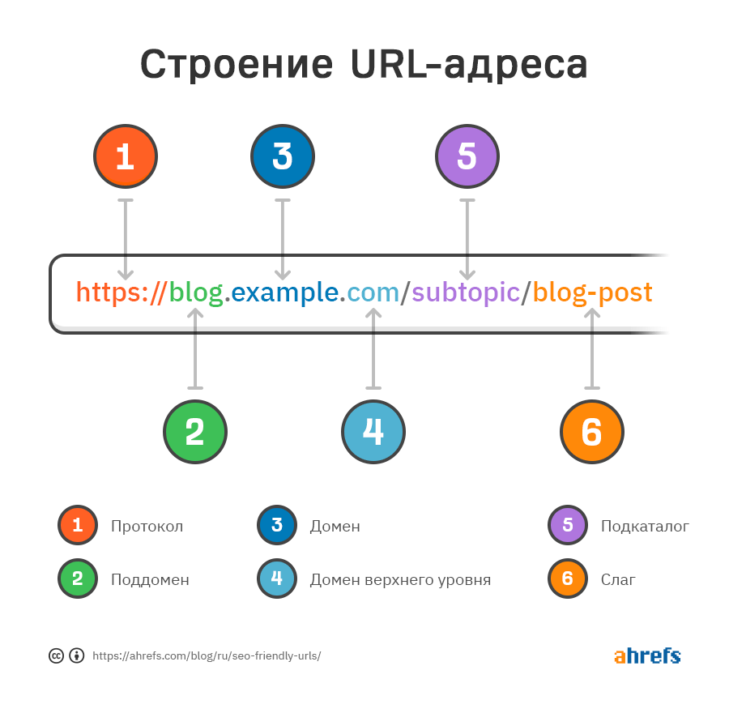

# Веб. Базові поняття 

## Web

Веб або всесвітня павутина (World Wide Web, Web, WWW) - це розподілена система, що надає доступ до пов'язаних між собою документів та інших ресурсів, розташованих на різних комп'ютерах, підключених до мережі Інтернет, а також до онлайн послуг.

## URL

Кожен із ресурсів може бути доступний через URL (Uniform Resource Locator, уніфікований покажчик ресурсу). URL включає явно або мається на увазі неявно стандартизований протокол доступу до ресурсу, наприклад, `http`. `https`, `ftp`.

Доменне ім'я — символьне ім'я, що служить для ідентифікації областей, які є одиницями адміністративної автономії в мережі Інтернет, у складі такої області, що стоїть за ієрархією. Кожна з таких областей називається доменом.

## Браузер

Бра́узер, також бравзер, переглядач, вебпереглядач, вебоглядач, вебнавігатор (англ. browser) — програмне забезпечення для комп'ютера або іншого електронного пристрою, як правило, під'єднаного до Інтернету, що дає можливість користувачеві взаємодіяти з текстом, малюнками або іншою інформацією на гіпертекстовій веб-сторінці.

Тексти та малюнки можуть містити посилання на інші вебсторінки, розташовані на тому ж вебсайті або на інших вебсайтах. Вебпереглядач з допомогою гіперпосилань дозволяє користувачеві швидко та просто отримувати інформацію, розміщену на багатьох вебсторінках.

Популярні браузери: **Google Chrome**, **Mozilla Firefox**, **Microsoft Edge**, **Opera**, **Safari**.

Частка ринку (популярність) браузерів різна для різних пристроїв та операційних систем на них.

- [Доля рынка топ браузеров — similarweb.com](https://www.similarweb.com/ru/browsers/)
- [ТОП-10 Лучших Браузеров 2023 года для Windows — all-browsers.com](https://all-browsers.com/best-browsers/)
- [Популярные браузеры в Украине в 2023 году — unian.net](https://www.unian.net/techno/sostavlen-reyting-samyh-populyarnyh-brauzerov-v-ukraine-v-2023-godu-12280569.html)

## HTML & CSS & JavaScript

Всесвітня павутина нерозривно пов'язана з поняттями гіпертексту та гіперпосилання. Більшість інформації в Інтернеті є саме гіпертекст.

Для створення, зберігання та відображення гіпертексту у Всесвітньому павутинні традиційно використовується мова [**HTML**](/docs/сoding-languages/html5+css3.md) (англ. HyperText Markup Language «мова розмітки гіпертексту»). Робота зі створення (розмітці) гіпертекстових документів називається версткою, вона робиться веб-майстром або окремим фахівцем з розмітки - верстальником. Після HTML-розмітки документ, що вийшов, зберігається у файл, і такі HTML-файли є основним типом ресурсів Всесвітньої павутини. Після того, як HTML-файл стає доступним веб-серверу, його починають називати веб-сторінкою. Набір веб-сторінок утворює веб-сайт.

Гіпертекст веб-сторінок містить гіперпосилання. Гіперпосилання допомагають користувачам Всесвітньої павутини легко переміщатися між ресурсами незалежно від того, чи знаходяться ресурси на локальному комп'ютері або на віддаленому сервері.

Для покращення візуального сприйняття вебу використовується технологія [**CSS**](/docs/сoding-languages/html5+css3.md), яка дозволяє задавати єдині стилі оформлення для багатьох веб-сторінок.

Для надання інтерактивності веб-сторінкам у браузері широко використовується мова програмування [**JavaScript**](/docs/сoding-languages/js-ts.md).

