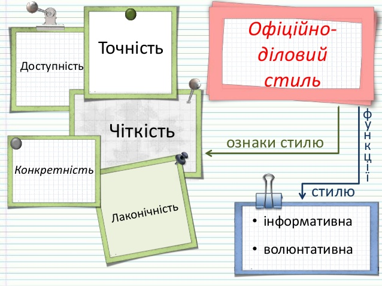

# Ділове листування

[Офіційно-діловий стиль української мови ](https://zno.if.ua/?p=4807)

:::info "Інформаційна та волюнтативна функціЇ"

    Інформаційна функція документа полягає в передачі точної і стислої інформації.

    Волюнтативна функція – вираження волі щодо співрозмовника: прохання, запрошення, порада, спонукання тощо.

Корисні матеріали по діловому листуванні:

- [ДІЛОВЕ ЛИСТУВАННЯ — ЗРАЗКИ СЛУЖБОВИХ ЛИСТІВ](https://pozovna.in.ua/zrazki-listiv)
- [Як правильно почати та завершити професійний діловий електронний лист](https://business.tutsplus.com/uk/tutorials/how-to-start-and-end-a-professional-business-email--cms-26313)
- [Як писати так, щоб вам відповідали: правила ділового листування](https://happymonday.ua/pravyla-dilovogo-lystuvannya)
- [Етикет ділового листування](https://pidru4niki.com/1031020840649/dokumentoznavstvo/etiket_dilovogo_listuvannya)
- [«Словники України» online](https://lcorp.ulif.org.ua/dictua/)
