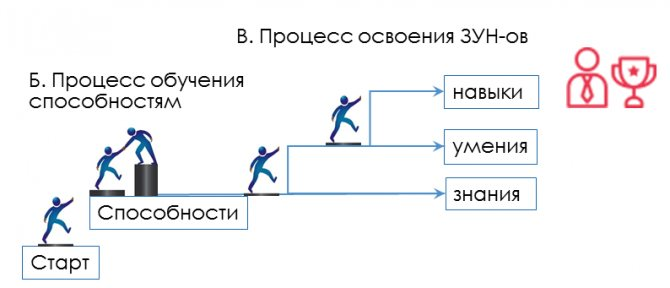
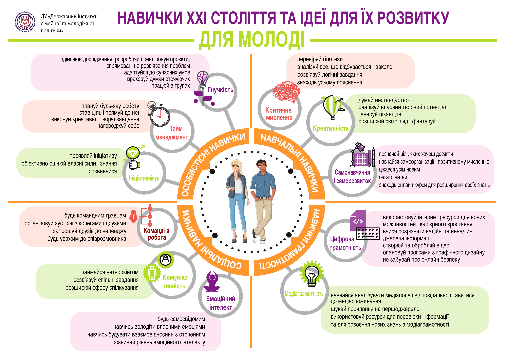

# Знання, Уміння та Навички

## Визначення ЗУН

**Знання** – це засвоєні у процесі навчання певні факти, які людина розуміє, пам'ятає і може відтворити з пам'яті. Саме собою знання не несе ніякої практичної користі, якщо не трансформуються на наступний рівень – вміння.

**Уміння** - це рівень освоєних способів виконання на практиці, що забезпечується отриманими знаннями. Іншими словами, якщо знання припускають теорію, то уміння - це вже використання знань на практиці.

**Навичка** - це вміння, доведене до автоматизму шляхом багаторазових повторень тих самих дій на практиці.

## Здібності

Саме здібності лежать в основі навчання знань, умінь та навичок.

**Здібності** - це сукупність вроджених та набутих якостей, які є умовами для успішного здійснення певних дій. Вони визначають, наскільки швидко, легко та міцно людина зможе освоїти ту чи іншу діяльність.

Більшість фахівців у галузі психології сходяться на думці, що здібності формуються протягом усього життя людини.
Але для їх розвитку мають бути причини, саме наявність так званих задатків, які даються людині великою мірою від народження.

Деякі вчені стверджують, що на успішність людини головним чином впливає виховання та освіта.

Чинник особистих вольових зусиль також має значення. Історія знає чимало прикладів того, як люди без особливих схильностей до певного виду діяльності вимагали у ній великих висот. Так, болісний та недорікуваний Демосфен шляхом рішучих зусиль та самоорганізації зміг стати геніальним оратором.

## Жорсткі та м'які навички

**Жорсткі навички** – (англ. Hard skills) професійні навички, яким можна навчити та які можна виміряти. Для навчання hard skills необхідно засвоїти знання та інструкції, якість навчання можна перевірити за допомогою іспиту. Приклади hard skills: набір тексту на комп'ютері, керування автомобілем, читання, математика, знання іноземної мови, використання комп'ютерних програм.

**М'які навички** - (англ. Soft skills) універсальні компетенції, які набагато важче виміряти кількісними показниками. Іноді їх називають особистими якостями, тому що вони залежать від характеру людини і здобуваються з особистим досвідом. Приклади soft skills: такі соціальні, інтелектуальні та вольові компетенції, як комунікабельність, уміння працювати у команді, креативність, пунктуальність, врівноваженість.

Терміни hard і soft skills беруть початок у військовій справі. 1959 року армія США почала розробляти науково обґрунтований підхід до підготовки військовослужбовців. У результаті розробки дослідники виявили важливість для військовослужбовців як професійних навичок (hard skills), але універсальних компетенцій (soft skills), які піддаються планомірному навчанню. Розуміння відмінностей між soft і hard skills було виражено в доктрині "Системи проектування військової підготовки" 1968 таким чином: hard skills є навичками роботи переважно з машинами, soft skills - навичками роботи з людьми та паперами. Після того, як терміни прижилися у військовій науці та психології, вони перейшли у вільне вживання у сфері бізнесу. Сьогодні у вакансіях, у тому числі російською та українською мовами, можна зустріти замість розділів "професійні навички" та "особисті якості" - hard skills та soft skills.

## Інформаційні ресурси

- [Навыки и способности человека – что это такое, чем отличаются и как их развить — quasa.io (ru, en)](https://quasa.io/ru/media/navyki-i-sposobnosti-cheloveka-chto-eto-takoe-chem-otlichayutsya-i-kak-ih-razvit)
- [Навички ХХІ століття та умови їх формування і розвитку для молоді — dismp.gov.ua](https://dismp.gov.ua/navychky-khkhi-stolittia-ta-umovy-ikh-formuvannia-i-rozvytku-dlia-molodi/)
- [Професійні навички 2023 року – аналіз від Coursera — istu.edu.ua](https://istu.edu.ua/професійні-навички-2023-року/)
- [20 професійних навичок, що стануть найважливішими у 2023 році — finance.ua](https://news.finance.ua/ua/20-profesiynyh-navychok-shho-stanut-nayvazhlyvishymy-u-2023-roci)
- [Как повысить устные навыки общения — habr.com](https://ru.wikihow.com/повысить-устные-навыки-общения)
- [Как развить внимание: подробное руководство — blog.calltouch.ru](https://blog.calltouch.ru/kak-razvit-vnimanie-podrobnoe-rukovodstvo/)
- [Зачем инженеру soft skills — habr.com](https://habr.com/ru/company/epam_systems/blog/418621/)
- [20 навыков, которые нужны каждому программисту — rb.ru](https://rb.ru/story/20-musthave-skills/)
- [8 принципов планирования разработки, упрощающих жизнь — habr.com](https://habr.com/ru/company/edison/blog/272085/)
