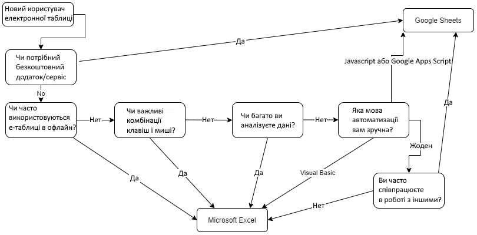

# Електронні таблиці

## Загальні відомості

Електронні таблиці (табличні процесори) є одним з найпопулярніших інструментів, що використовуються на персональних комп'ютерах. Електронні таблиці призначені для відображення, маніпулювання, обчислення, організації, аналізу та зберігання даних у табличній формі.

Найбільш відомими та популярними реалізаціями електронних таблиць є додатки:

- **Microsoft Excel** - входить у пакет Microsoft Office і є одним з найпопулярніших інструментів для обробки даних у світі, який існує вже майже 40 років
    - платний
    - настольний і інтернет-версія (в пакеті Microsoft Office 365)
    - розширені функції
    - співпраця в реальному часі не так ефективна, як у Google Sheets
- **Google Sheets** - хмарна платформа для створення та редагування таблиць, яка дозволяє кільком користувачам працювати одночасно. Вона є частиною пакета Google Workspace
    - безкоштовний з обмеженнями
    - тільки інтернет-версія
    - спільна робота за задумом

## Блок-схема вибору

## Джерела інформації

- [Google Sheets VS Microsoft Excel: що обрати для роботи з даними? | data-b-i.com](https://data-b-i.com/uk/article/Google+-Sheets-VS-Microsoft-Excel-shchyo-obraty-dlya-roboty-z-danymy.html)
- [Google Таблиці проти Excel – що краще у 2024 році? | spreadsheetpoint.com](https://spreadsheetpoint.com/excel-vs-google-sheets/)
- [Spreadsheetpoint | spreadsheetpoint.com](https://spreadsheetpoint.com/)
- [Мистер Офис | mister-office.pro](https://mister-office.pro/)
- [Работа в Excel с формулами и таблицами данных | exceltable.com](https://exceltable.com/ru/)
