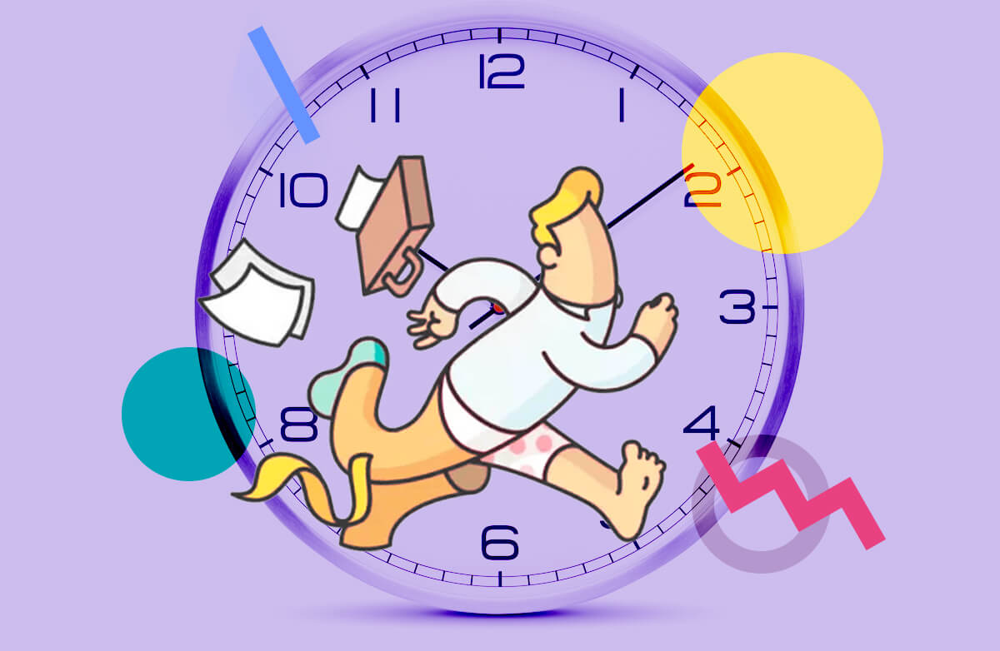
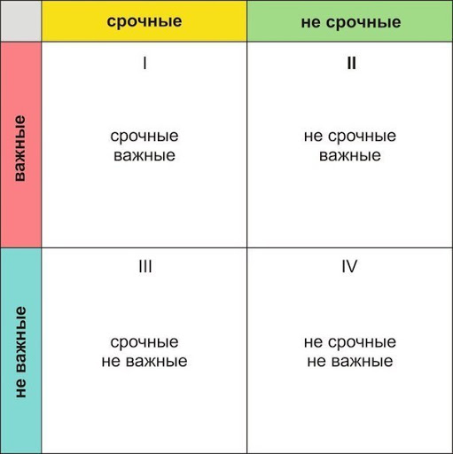
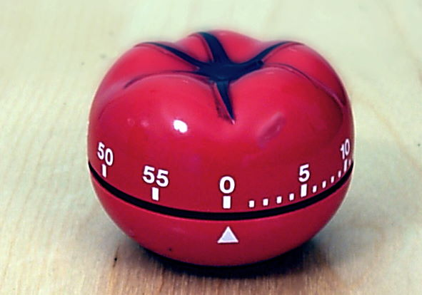

# Управление временем

## Общие сведения

Управление временем («Тайм-менеджмент») - это процесс организации и планирования того, как разделить время между конкретными видами деятельности. Хорошее управление временем позволяет работать умнее, а не тяжелее, так что можно сделать больше за меньшее время, даже когда время ограничено и давление высокое. Неспособность управлять своим временем наносит ущерб эффективности и вызывает стресс.

Кажется, что никогда не хватает времени ежедневно. Но, поскольку у нас у всех одни и те же 24 часа, почему некоторые люди достигают гораздо большего в своем времени, чем другие? Ответ заключается в хорошем управлении временем.

Самые успешные отлично справляются со своим временем. Используя методы управления временем, описанные в этом разделе, можно улучшить свою способность функционировать более эффективно, даже когда время ограничено и давление велико.

Хорошее управление временем требует важного смещения акцента с деятельности на результат: занятость - это не то же самое, что эффективность.

## 6 законов тайм-менеджмента

1. Закон Стива Тейлора: Порядок ваших действий сильно влияет на эффективность.
   Не надо заниматься рутинной работой, если в этот момент чувствуете прилив сил, бодрости и огромное желание творить. Сразу приступайте к своим большим проектам и делайте, делайте, делайте.
   И напротив, когда твоя энергия на исходе - попробуй заняться нудным и неинтересным перекладыванием стопок бумаг, интернет-серфингом и другими монотонными занятиями.
   

2. Закон стагнации: При получении определённых результатов прирост эффективности снижается.
   Когда ты стремишься к какой-либо цели, особенно на начальном этапе - у тебя начинает что-то получаться, и главное в этот момент не расслабиться. Если остановиться или решить отдохнуть - тут же начнётся спад в эффективности.
   Вернуться к прежним результатам будет очень тяжело. Поэтому не стоит ждать до последнего, лучше постоянно шаг за шагом двигаться к результату. В таком случае у тебя не будет большого спада производительности и мотивации.

3. Закон Генри Лаборита: У каждого человека есть склонность, талант, особенность делать то, что ему доставляет удовольствие.
   Если ты в полной мере следуешь этому закону, если на вопрос: «Работаешь?», ты говоришь: «Я не работаю, я занимаюсь любимым делом» - то это лучший вариант развития событий. Чаще всего люди работают на нелюбимых, даже противных им работах. Они ходят туда только за зарплатой, а потому не видят, что они могут зарабатывать на своем любимом деле.
   Естественно такие люди малоэффективны и время проходит мимо. Но в то же время в жизни бывает много ситуаций, когда просто необходимо что-то сделать, даже если это не нравится. И это того стоит, если ты идешь по своему пути, к своей мечте.

4. Закон неподдельного интереса: Чем выше твой интерес к какому-либо делу или занятию, тем быстрее течёт время.
   Когда чем-то по настоящему увлечен, время летит незаметно. Здесь главное не забывать: даже, если дело тебе действительно интересно, не надо впадать в крайности.
   Всегда помни: куда ты идешь и что у тебя еще есть семья, твое тело, здоровье, друзья, отношения и сон в конце концов.

5. Закон Паркинсона: На любую работу тратится именно столько времени, сколько вы на неё отвели.
   То есть, если ты решил, к примеру, написать статью за один день, то и писать ты её будешь один день. Ты можешь выделить под одно дело целый день, а можешь сделать 10 дел и более - в том случае, если точно запланировал конкретное время на выполнение каждого дела.
   На современном языке это значит ставить "дедлайн" на каждое дело. Как только ты начнешь использовать ограничение по времени, твое КПД увеличиться как минимум в два раза. А это значит, что сделанных дел и времени станет в два раза больше.

6. Закон Паретто: 20 % ваших действий приносят целых 80 % успешных результатов.
   Все остальные дела, которые ты делаешь в течении оставшихся 80% жизни приводят лишь к 20% результатов. И эти 80% дел, которые делают большинство людей забирают практически все активное время твоей жизни.
   20% из всех твоих дел - есть самые главные дела в твоей жизни. Самое главное правильно их найти, выделить и делать каждый день

_Подробнее:_

shest-osnovnyh-pravil-tajm-menedzhmenta/)
- [8 нестыдных техник тайм-менеджмента, которые убьют вашу прокрастинацию](https://bit.ua/2018/07/8-tehnik-tajm-menedzhmenta/)

## Метод помидора

Метод «Помидора» — техника управления временем, предложенная Франческо Чирилло в конце 1980-х. Техника предполагает разбиение задач на 25-минутные периоды, называемые «помидоры», сопровождаемые короткими перерывами.

Нередко в зависимости от выполняемых задач периоды работы и отдыха могут меняться.

Базовые принципы:

1. Определитесь с задачей, которую будете выполнять.
2. Поставьте помидор (таймер) на 25 минут.
3. Работайте, ни на что не отвлекаясь, пока таймер не прозвонит. Если что-то отвлекающее возникло у вас в голове, запишите это и немедленно возвращайтесь к работе.
4. Сделайте короткий перерыв (3-5 минут).
5. После каждого 4-го «помидора» сделайте длинный перерыв (15-30 минут).

_Подробнее:_

- [Метод "Помидора" для борьбы с прокрастинацией](https://pikabu.ru/story/metod_pomidora_dlya_borbyi_s_prokrastinatsiey_5658468)
- [Метод Pomodoro не так крут, как мог бы быть](https://habr.com/ru/post/446996/)
- [Focus To-Do - приложение для управления временем и задачами](https://www.focustodo.cn/)
