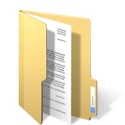
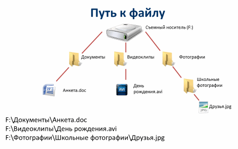

# Работа с документами на ПК

> Ви можете отримати або уточнити свої базові знання з комп'ютерної грамотності тут:
> [Базовая Компьютерная Грамотность — youtube.com](https://www.youtube.com/watch?v=-0IKU6Adczo&list=PLH9jYruSTvF5Y11doVb2KswPb8HkMUylt)

## Общие сведения

|                                              | Организация файлов - порядок в работе                                                                                                                                                                                                                                                                                                                                                                                                                     |
| -------------------------------------------- | --------------------------------------------------------------------------------------------------------------------------------------------------------------------------------------------------------------------------------------------------------------------------------------------------------------------------------------------------------------------------------------------------------------------------------------------------------- |
|  | Организация файлов на компьютере – не только один из самых простых, но и самых недооцененных аспектов организации работы. Если вам кажется, что на вашем компьютере все в порядке, протестируйте себя: попробуйте найти документы, которыми пользуетесь чаще всего, без помощи Windows Search. Если не получилось – вы просто обязаны разобраться с документами. О том как это сделать, рассказывается этой в статье. В качестве ОС предполагаем Windows. |

## Несколько простых правил хранения

  

    Не размещайте файлы на рабочем столе
  

  

    

    На рабочем столе должны быть только рабочие ярлыки.
    В очень редких исключениях можете оставить текстовый файл, если пользуетесь им регулярно.
    

    

    Если у вас личный компьютер, то предпочтительнее хранить документы не на системном диске,
    а на отдельном логическом диске. Если это рабочий компьютер на фирме,
    то согласуйте это с ИТ-администратором,
    который определяет политику по сохранности документов на фирме.
    

  

  
Привыкайте мыслить иерархично

  

    

      Такой тип мышления требует уроков мастерства. Нужно время, чтобы привыкнуть. Но если вы хотите работать с файлами и документами эффективно, придется научиться.
    

    

      Есть 3 основные разделения по иерархии: вверх, вниз и в сторону. Например, зайдите на большинство сайтов и перед вами предстанет информация, которая структурирована иерархично: разделы и подразделы сайта, категории предлагаемых продуктов и услуг и т.д.
    

  

  
Создайте свою иерархию документов

  

    

    На выбранном вами рабочем диске создайте корневую папку для ваших документов, а в ней подпапки в соответствии с вашей иерархией документов. При создании иерархии учитывайте возможность удобства архивации папок как отдельно по направлениям, так и всех документов в целом.
    

    

    <i>Майкрософт рекомендует хранить документы в папке "Мои документы".
     Обычно ее и предлагают по умолчанию приложения, у каждого из которого своя подпапка.
     Если у вас всего один диск, то это также будет хорошим решением.</i>
    

    

    Также при создании иерархии документов рекомендуется учитывать такие общие характеристики:
    

    <ul>
      <li>личные документы, которые можно разделить согласно сфер вашей личной жизни,
       например, финансы, здоровье, образование, отдых и т.д.</li>
      <li>деловые документы, организация которых во многом будет зависит от вашей профессии.</li>
      <li>временной период в соответствующих разделах вашей иерархии,
       если документов соответствующего раздела достаточно много. 
       Например, имена подкаталогов могут быть соответствовать шаблонам, ГГГГ, ГГГГ-ММ 
       или эти шаблоны могут добавляться к именам таких разделов.</li>
      <li>критичность документов по безопасности. 
       Например, при архивации папки с такими документами будет осуществляться
        их шифрование перед помещением их на другие носители, в том числе облачные.</li>
    </ul>
  

  
Создавайте архивные копии документов

  

    

    Всегда наступает тот день, когда вы не сможете получить доступ к вашим документам из-за порчи рабочего носителя по разным причинам, если не выполнялась их архивация вами или ИТ-администратором в офисе на другие физические носители.
    

    

    Архивация документов может осуществляться в составе полной архивации операционной системы или отдельно с какой-то вами установленной периодичностью, которая зависит от ценности этих документов для вас и, возможности и цены их восстановления.
    

    

    Для архивации системы и данных в современных операционных системах есть достаточно инструментов, но можно воспользоваться и дополнительными средствами. Примеры вариантов архивации:
    

    <ul>
      <li>средство «Резервное копирование и восстановление»</li>
      <li>создание зеркала папок с документами на другом физическом носителе
       и синхронизация при помощи утилиты robocopy.exe с требуемой периодичностью,
       не чаще 1 раза в сутки, определив задачу в Планировщике заданий</li>
      <li>подключение к облачному хранилищу, например, Microsoft OneDrive, 
       которое одно из самых надежных и бесплатно предоставляется место до 5 ГБ. 
       Установите программу OneDrive, задав каталог синхронизации на отдельном логическом диске от системного.
       Создайте в этом каталоге похожую иерархию файлов как в основном рабочем каталоге документов.
       По мере потребности копируйте необходимые документы в соответствующий каталог OneDrive.
       Такие документы в фоновом режиме будут копироваться в облачное хранилище
       и с другого устройства через веб-браузер вы будете иметь доступ к этим документам.
       Также если вы на другом компьютере возьмете документ с OneDrive, 
       отредактируете его и поместите вновь в хранилище OneDrive или добавите другой,
       то на основном рабочем компьютере в каталоге OneDrive вы сможете работать
       с такими документами после синхронизации.</li>
      <li>по мере необходимости можно вручную архивировать отдельные папки ваших документов
       при помощи обычных архиваторов, например, 7-Zip или PiaZip.
       Рекомендуется к имени архива добавлять метку времени
       по шаблону ИМЯ_АРХИВА.ГГММДДx, где ГГ год, ММ месяц, ДД день, 
       x - последовательная буква английского алфавита для архива за указанный день.
       Расширение зависит от выбранного формата архива. 
       Файл архива следует переместить или скопировать на отдельный физический носитель.</li>
    </ul>
  

  
Создавайте архивные копии данных программ

  

    Во многих программах есть данные, которые организованы как базы данных в своем формате. Например, к таким программам относятся почтовые клиенты, M.E.Doc, ArtZvit, 1C. В них предусмотрены собственные механизмы архивирования данных и восстановления. Пользуйтесь этими внутренними инструментами, так как обычно программы создают архивы в переносимом формате, то есть такой архив может быть восстановлен в этой же программе, но более новой версии, хотя формат данных в этой новой версии уже изменился.
  

## Понятие о пути к файлу в Windows

Обратиться к файлу, находящемуся не в текущем каталоге, можно напрямую, используя путь к нему.

Путь к файлу — это последовательность из имён каталогов или символов **`..`**, разделённых символом **`\`** (обратный слэш), задающий маршрут от текущего или корневого каталога к тому, в котором находится нужный файл. Путь, начинающийся с **`\`**, воспринимается компьютером как путь от корневого каталога. Каждое имя каталога, указанное в пути, соответствует входу в каталог с этим именем. Символ **`..`** обозначает переход в родительский каталог. Путь к файлу от корневого каталога называют абсолютным путём, а от текущего — относительным путём.

Путь к каталогу файла и имя файла, разделённые «\», перед которыми указано имя диска, представляет собой полное имя файла. Если имя диска опущено, подразумевается текущий дисковод.

Имя диска представляет собой латинскую букву алфавита и отделяется от остальной части пути символом **`:`**. Обычно имя системного диска **`C`**.

## Понятие о типе файла

Тип документа (основной формат) в Windows определяется по основному расширению к имени файла: последовательности символов, добавляемых к имени файла после последней точки. Это один из распространённых способов, с помощью которых пользователь или программное обеспечение компьютера может определить тип данных, хранящихся в файле.

При клике на документе, который находится на Вашем компьютере, Windows ищет программу по умолчанию, которая связана с данным типом документа, запускает ее и указывает программе на этот документ, а уже ассоциированная программа открывает указанный документ.

На компьютере может быть установлено несколько программ, работающих с одним и тем же типом документа. Если необходимо открыть документ в программе не по умолчанию, то в контекстном меню файла документа (по клику правой клавишей мыши) необходимо указать такую программу через **Открыть с помощью …**.
