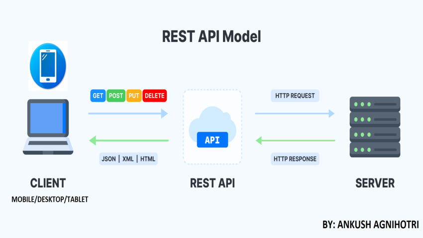
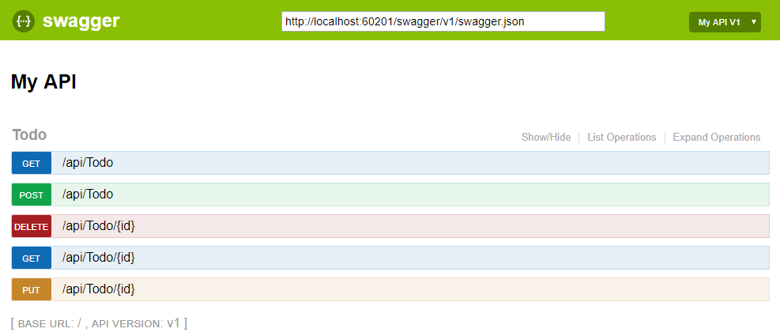
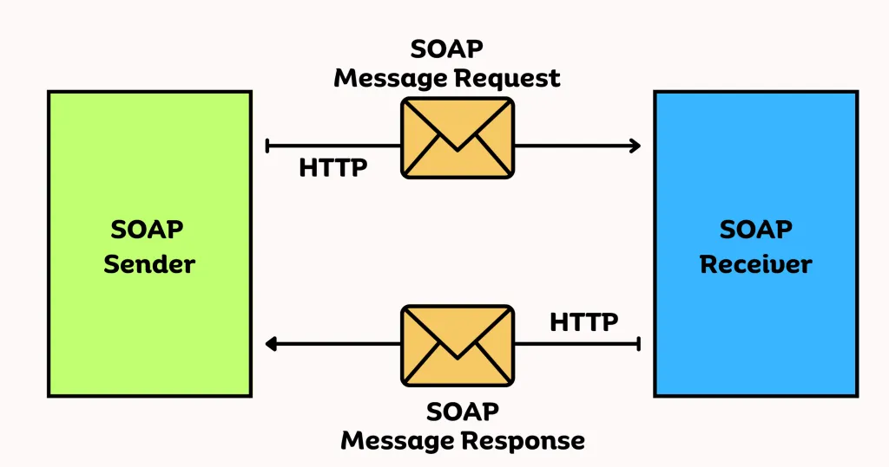
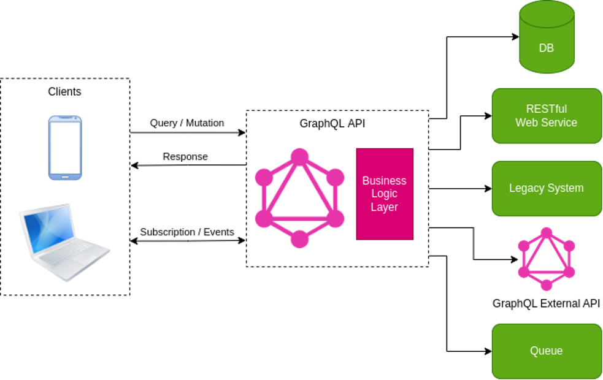
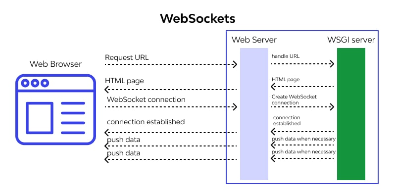

# Архітектурні стилі API

## Загальні відомості

Незалежно від того, чи впроваджуєте ви архітектуру мікросервісів, яка буде масштабованою та відмовостійкою, чи орієнтована на перспективу щодо можливостей взаємодії, API-інтерфейси забезпечують необхідний рівень абстракції, що забезпечує зв'язок між окремими частинами програмного забезпечення.

Зміна архітектури API після того, як вона запущена, - це неабиякий подвиг, тому перед її створенням необхідно витратити час на визначення ваших потреб та цілей для вашого API - це корисний крок, який допоможе вам створити API, який ви хочете.

  
API – Application Programming Interface

  

API - Application Programming Interface, що означає програмний інтерфейс програми. У контексті API слово «програма» стосується будь-якого ПЗ з певною функцією. Інтерфейс можна розглядати як сервісний контракт між двома програмами. Цей контракт визначає, як вони взаємодіють один з одним, використовуючи запити та відповіді. Документація API містить інформацію про те, як розробники повинні структурувати ці запити та відповіді.

Архітектура API зазвичай пояснюється з погляду клієнта та сервера. Програма, що надсилає запит, називається клієнтом, а програма, що надсилає відповідь, називається сервером.

  

Для забезпечення взаємодії між клієнтами та серверами повинен існувати узгоджений спосіб обміну запитами та відповідями між клієнтами та серверами. Це взаєморозуміння досягається за рахунок використання стандартної архітектури веб-API, будь то REST, gRPC, GraphQL або OpenAPI.

- [Найкращі архітектурні стилі для API у 2023 році (англ.) — nordicapis.com](https://nordicapis.com/top-architectural-styles-for-apis-in-2023/)
- [Руководство по различным типам API — habr.com](https://habr.com/ru/companies/otus/articles/737610/)
- [Понимание REST, gRPC, GraphQL и OpenAPI для создания собственных API (англ.) — koyeb.com](https://www.koyeb.com/blog/understanding-rest-grpc-graphql-and-openapi-to-build-your-apis)

## REST

**REST (REpresentational State Transfer)** – це архітектура, тобто принципи побудови розподілених гіпермедіа систем, що називається World Wide Web, включаючи універсальні методи обробки та передачі станів ресурсів по HTTP.

- [Что такое REST API и чем оно отличается от другого API?](https://appmaster.io/ru/blog/chto-takoe-rest-api-i-chem-ono-otlichaetsya-ot-drugogo-api)
- [Учебник. Создание веб-API с помощью ASP.NET Core — learn.microsoft.com](https://learn.microsoft.com/ru-ru/aspnet/core/tutorials/first-web-api?&tabs=visual-studio)

## OpenAPI

Архітектурний стиль REST пропонує багато рішень на відкуп розробникам. З одного боку, це правильно, адже завдання REST — не зафіксувати специфікацію, а визначити принципи побудови хорошого HTTP API. В цьому сенсі REST — дуже продумана концепція, яка не залежить від моди і не змінюється десятки років.

З іншого боку, REST API дає багато свобод і не вказує, як організовуються посилання, які структури даних надсилаються та повертаються. Це призводить до того, що всі REST API сильно відрізняються від іншого.

Специфікація OpenAPI, початково відома як Swagger - це специфікація машиночитабельних файлів з інтерфейсами, для опису, створення, використання і візуалізації REST веб сервісів.Існують різноманітні інструменти що можуть генерувати код, документацію і тести за файлом з описом інтерфейсу. За розробкою специфікації OpenAPI (OAS) наглядає Open API Initiative, проект Linux Foundation.

- [openapis.org](https://www.openapis.org/)
- [Документация по веб-API ASP.NET Core с использованием Swagger (OpenAPI) — learn.microsoft.com](https://learn.microsoft.com/ru-ru/aspnet/core/tutorials/web-api-help-pages-using-swagger)
- [How to use OpenAPI in ASP.NET Core — infoworld.com](https://www.infoworld.com/article/3685428/how-to-use-openapi-in-aspnet-core.html)
- [swagger.io](https://swagger.io/)
- [Swagger Editor — swagger.io](https://swagger.io/tools/swagger-editor/)

## Webhooks

**Webhooks (веб-перехоплювач)** – це тип API, керованого подіями. Замість того, щоб надсилати інформацію у відповідь на запит іншої програми, веб-перехоплювач відправляє інформацію або виконує певну функцію у відповідь на тригер — наприклад, час доби, натискання кнопки або отримання форми. Оскільки програма, яка надсилає дані, ініціює передачу, веб-перехоплювачі часто називають «зворотними API».

Веб-перехоплювачі не вимагають багато "розмов" - дані передаються в одному напрямку, а не в двох. Це просто кінцеві точки API, вказані розробником, що робить їх досить простими проти повноцінними API.

Оскільки вони запрограмовані так, щоб не мати доступу до такої кількості інформації як цілі системи API, їх використання досить обмежене. Однак вони виявляються корисними, коли користувач хоче виконати функцію програми, навіть не відкриваючи програму. Ось кілька ідей, коли вебхук буде найбільш доречним:

- Оновлення статусу передплати користувача у вашій системі управління взаємовідносинами з клієнтами (CRM), коли користувач відмовляється від передплати
- Надсилання автоматичних нагадувань про збори за п'ять хвилин до їх початку
- Надсилання повідомлень електронною поштою, в яких користувачам, які намагаються зв'язатися зі співробітником на умовах PTO, повідомляється дата його повернення.
- Повідомлення користувача, що володіє акціями компанії, коли ціна акцій падає на 5% за день

Якщо запит веб-перехоплювача відформатовано неправильно, ви не отримаєте детальної відповіді, що пояснює, чому ваша функція не вдалася, — ви просто отримаєте код стану, наприклад 200 або 404. Тому важливо протестувати свій веб-перехоплювач. (і регулярно перевіряйте його ще раз), щоб переконатися, що він працює правильно.

Двома словами, веб-перехоплювач — це підхід, відмінний від звичайного веб-API. На відміну від звичайного розгортання API RESTful, коли на сервері розміщується кінцева точка API на основі HTTP, яку клієнти («споживачі API») отримують дані з одного запиту за раз, веб-перехоплювачі змінюють напрямок діалогу. Це клієнт, на якому розміщена кінцева точка API на основі HTTP, на яку сервер надсилає дані в міру їх появи. Ця кінцева точка називається веб-перехоплювачем.

- [Обзор веб-перехватчиков ASP.NET — learn.microsoft.com](https://learn.microsoft.com/ru-ru/aspnet/webhooks/)

## SOAP

SOAP є протокол, який заснований на XML, в той час як REST - це, по суті, архітектурний підхід.

Хороший приклад для RESTful -- JSON через HTTP, приклад для SOAP -- це XML поверх SOAP через HTTP, у своїй слід додати, що у верхньому рівні SOAP обмежує структури повідомлень.

Специфіка SOAP полягає у форматі обміну даними. В даному випадку це завжди SOAP-XML, що представляє собою XML, який включає:
- конверт (Envelope) - кореневий елемент, що визначає повідомлення та простір імен, що використовується в документі;
- Заголовок (Header) - включає в себе атрибути повідомлення, наприклад, інформацію про безпеку або інформацію про мережну маршрутизацію,
- тіло (Body) – включає повідомлення, яким обмінюються додатки,
- Fault – це необов'язковий елемент, який надає інформацію про помилки, що сталися під час обробки повідомлень.

Як запит, і відповідь повинні відповідати SOAP-структуре.

Протокол SOAP застосовує WSDL (Web Services Description Language) - це заснована на XML мову, яка служить для опису web-сервісів та доступу до них.

У SOAP немає обмежень на тип транспортного протоколу, що використовується, тобто існує можливість застосовувати той же HTTP або, наприклад, MQ.

- [Все о веб-сервисах SOAP и REST в 2023 году — servicenowspectaculars.com](https://servicenowspectaculars.com/all-about-soap-rest-web-services-in-2023/)
- [SOAP Web Services in .NET Core — worldit.pt](https://www.worldit.pt/about-us/blog/soap-web-services-in-net-core/)
- [Consuming SOAP Services in .NET Core — blog.simontimms.com](https://blog.simontimms.com/2022/05/30/consuming-wsdl/)

## GraphQL

GraphQL – це відкрита мова запитів та обробки даних для API та механізму виконання запитів.

GraphQL забезпечує декларативну вибірку даних, коли клієнт може вказати, які дані йому потрібні з API. Замість кількох кінцевих точок, які повертають окремі дані, сервер GraphQL надає одну кінцеву точку та відповідає саме тими даними, які запросив клієнт. Оскільки сервер GraphQL може отримувати дані з окремих джерел і представляти дані в єдиному графі, він не прив'язаний до будь-якої конкретної бази даних або механізму зберігання.

- [graphql.org](https://graphql.org/)
- [Введение в GraphQL (англ.) — encora.com](https://www.encora.com/insights/introduction-to-graphql)
- [GraphQL против REST: все, что вам нужно знать (англ.) — kinsta.com](https://kinsta.com/blog/graphql-vs-rest/)
- [GraphQL против. REST API (англ.) — hygraph.com](https://hygraph.com/blog/graphql-vs-rest-apis)
- [GraphQL Introduction and Product Application using .NET Core 7 — medium.com](https://medium.com/@jaydeepvpatil225/graphql-introduction-and-product-application-using-net-core-bd37faf3c585)
- [Get started with GraphQL in .NET Core — chillicream.com](https://chillicream.com/docs/hotchocolate/v13/get-started-with-graphql-in-net-core)

## Websockets

У широкому значенні WebSocket використовується, коли програмі потрібна безперервна або безперервна доставка даних. Наприклад, програма чату повинна постійно отримувати програму. Навіть якщо кінцевий користувач не відкриває програму, повідомлення має бути доставлене. Тільки WebSocket може забезпечити такий безперервний зв'язок. У такій безперервній доставці даних використання REST стане ресурсомістким, тоді як WebSocket полегшує роботу.

- [Веб-сокеты против REST API (англ.) — wallarm.com](https://www.wallarm.com/what/websocket-vs-rest-api)
- [Поддержка WebSockets в ASP.NET Core — learn.microsoft.com](https://learn.microsoft.com/ru-ru/aspnet/core/fundamentals/websockets?view=aspnetcore-7.0)
- [Класс Socket (C#) — metanit.com](https://metanit.com/sharp/net/3.1.php)

## gRPC

Вся архітектура заснована на відомій структурі клієнт-сервер.

Клієнтське додаток gRPC може виконувати прямі запити до серверного додатку. І клієнт, і сервер використовують загальний інтерфейс, подібний контракт, в якому він визначає, які методи, типи та значення, що повертаються,будуть матися в кожної операції.

- [grpc.io](https://grpc.io/)
- [gRPC и рабочая архитектура (англ.) — xenonstack.com](https://www.xenonstack.com/insights/what-is-grpc)
- [gRPC — learn.microsoft.com](https://learn.microsoft.com/ru-ru/dotnet/architecture/cloud-native/grpc)
- [Build High Performance Services using gRPC and .NET7 — medium.com](https://medium.com/geekculture/build-high-performance-services-using-grpc-and-net7-7c0c434abbb0)

