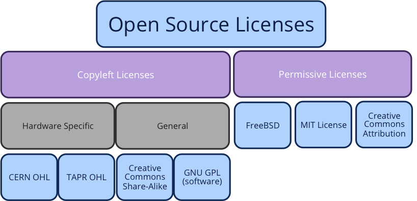
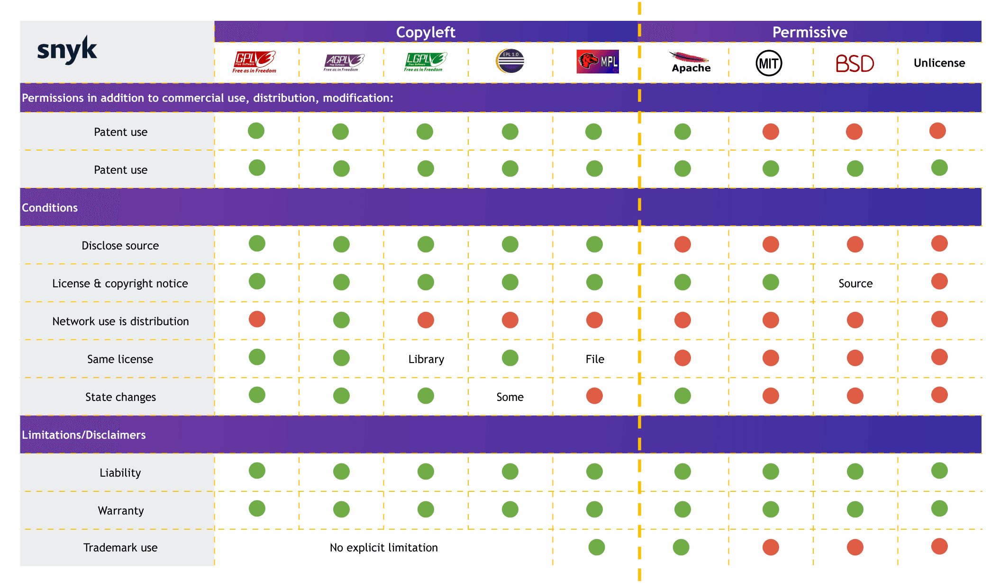

# Ліцензії Open-Source Software

## Загальні відомості

Якщо ви пишете код, ви також повторно використовуєте код, включаючи фрагменти коду, бібліотеки, функції, платформи та цілі програми. Весь програмний код постачається з певними правами та обов'язками, якщо ви хочете додати його до своєї кодової бази.

Безкоштовне програмне забезпечення з відкритим вихідним кодом (FOSS) є безкоштовним, але ви не можете використовувати його за своїм бажанням. Навіть неліцензовані фрагменти коду, скопійовані зі Stack Overflow, мають обмеження для повторного використання. Але формально розроблений код зазвичай постачається з певною ліцензією на програмне забезпечення.

:::info FOSS или FLOSS

FOSS або FLOSS — Free/Libre and Open-Source Software (вільне програмне забезпечення із загальнодоступним /відкритим/ вихідним кодом) — категорія програмного забезпечення, яка задовольняє двом вимогам одночасно: `вільне` і `відкрите`.

:::

Існує багато різних типів ліцензій на програмне забезпечення, причому деякі вимагають, щоб ви опублікували свій вихідний код. Щоб захистити свій код, ви повинні розуміти ці ліцензії на програмне забезпечення, перш ніж використовувати будь-який код, який ви не написали самостійно.

:::info Якщо ліцензія не визначена

**Без ліцензії застосовуються закони про авторські права за промовчанням, а це означає, що ви зберігаєте всі права на свій вихідний код, і ніхто не може відтворювати, розповсюджувати або створювати похідні з вашої роботи.**

Ви хочете випустити програму з відкритим кодом. Ви можете подумати: "Звичайно, я можу просто викласти це безкоштовно?"

На жаль, це не так просто! Без використання ліцензії з відкритим кодом інші не зможуть використовувати вашу роботу. Вам необхідно надати явний дозвіл. Навіть якщо ви розмістили його публічно на GitHub, найбільше, що дозволяють їх умови, - це переглядати та розгалужувати ваш проект, а не використовувати, змінювати чи ділитися ним.

:::

Підібрати конкретну ліцензію для відкритого коду можна [тут — choosealicense.com](https://choosealicense.com/).
Отримати детальнішу інформацію про ліцензування репозиторію Git можна [тут — github.com](https://docs.github.com/ru/repositories/managing-your-repositorys-settings-and-features/customizing-your-repository/licensing-a-repository).

## Copyleft ліцезії

 Copyleft — метод застосування механізмів авторського права (копірайту) в такий спосіб, щоб зробити об'єкт авторського права вільним до розповсюдження і вдосконалення, а також забезпечити, щоб модифіковані версії й похідні роботи також були вільними. Копілефт первинно виник як метод ліцензування для вільного програмного забезпечення, але може бути застосованим і до інших об'єктів авторського права.

Копілефт працює таким чином: власник авторських прав дозволяє вільно використовувати, змінювати, розповсюджувати його твір або будь-який похідний твір, лише за умови, що засади розповсюдження не будуть змінені (тобто, що будь-яка переробка твору також буде на умовах копілефту).

Термін «copyleft» утворений від поєднання англійських слів «copy» та «left», і підкреслює використання авторського права для захисту прав і свобод користувачів, на відміну від їх обмеження при традиційному застосуванні авторського права (copyright'у).

### Ліцензія GNU GPL

GNU GPL - це ліцензія з авторським лівом і, можливо, найпопулярніша ліцензія з відкритим вихідним кодом. Це гарантує розробникам свободу брати програму та модифікувати її так, як вони хочуть, за умови, що вони потім розповсюджують цю змінену версію як вільне програмне забезпечення. Він поставляється в двох різних версіях, GPLV2 і GPLV3, причому перша має виняток бібліотеки, чого немає в другій.

Розроблений в 1989 році (Річардом Столлменом), він спочатку призначався для захисту програмного забезпечення, розробленого під егідою проекту GNU. Якщо у вас є проект, доступ до якого ви хочете забезпечити навіть у змінених формах, то ця ліцензія — те, що вам потрібно. Ця ліцензія дозволяє будь-кому використовувати ваш код, гарантуючи, що змінені версії також будуть випущені як продукти з відкритим вихідним кодом. Це включає розміщення повністю зміненого вихідного коду у відкритому доступі.

### Ліцензія GNU LGPL

LGPL (GNU Lesser General Public License) - менша стандартна громадська ліцензія GNU дозволяє вам посилатися на бібліотеки з відкритим вихідним кодом у програмному забезпеченні. Якщо ви просто скомпілюєте або зв'яжете ліцензовану бібліотеку LGPL зі своїм власним кодом, ви можете випустити свою програму під будь-якою ліцензією, яку ви хочете, навіть з приватною ліцензією. Але якщо ви зміните бібліотеку або скопіюєте її частину в свій код, вам доведеться випустити вашу програму на умовах, аналогічних LGPL.

## Permissive (дозвільні) ліцензії

Дозвільні (пермісивні) ліцензії на вільне ПЗ (англ. Permissive free software licence) — ліцензії на програмні засоби, які практично не обмежують свободу дій користувачів ПЗ і розробників, що працюють з початковим кодом. Зокрема, дозвільні ліцензії самі по собі не обмежують вибір ліцензії для робіт, похідних від роботи з дозвільною ліцензією. Отже, дозвільні ліцензії не є копілефтом, на відміну від багатьох інших ліцензій відкритого і вільного ПЗ. За своїм духом, поширення роботи під дозвільною ліцензією подібне до розміщення роботи в суспільне надбання, але не вимагає відмови від авторського права.

Серед найвідоміших дозвільних ліцензій на вільне ПЗ — ліцензії BSD, MIT, Apache.

Permissive - разрешительные лицензии также известны как «стиль Apache» или «стиль BSD». Они содержат минимальные требования о том, как программное обеспечение можно модифицировать или распространять. Этот тип лицензии на программное обеспечение, пожалуй, самый распространенный и популярный среди свободного и открытого программного обеспечения. Помимо Apache и BSD, другим распространенным вариантом является лицензия MIT.

### Ліцензії BSD

Ліцензії BSD походять від операційної системи типу Unix. Вони належать до категорії дозвільних ліцензій, і існують мінімальні обмеження на їх використання та розповсюдження. Цей тип ліцензії дозволяє вам взяти оригінальний продукт BSD з відкритим вихідним кодом, потім скопіювати його, змінити та розповсюджувати відповідно до ваших потреб.

Існує два основних типи ліцензії BSD:

1. **Модифікована ліцензія BSD** (3 пункти), яка дає вам практично необмежену свободу вносити зміни до вихідного продукту, якщо ви включаєте оригінальне повідомлення про авторські права та ліцензії BSD.

2. **Лицензия FreeBSD**, которая содержит 2 пункта о том, что вы можете с ней делать.

### Ліцензія MIT (Масачусетський технологічний інститут)

Ліцензія MIT – ще одна дозвільна ліцензія. Він існує з кінця 1980-х років, тому дуже популярний серед розробників, які хочуть змінити програмний код відповідно до своїх потреб і створити новий продукт без будь-яких обмежень або хоча б мінімальних обмежень.

Одна з основних причин популярності ліцензії MIT полягає в тому, що вони можуть змінювати код, додавати до нього, а потім публікувати та розповсюджувати свою власну версію, а також продавати її. Якщо ви робите такі речі, як шаблони для угод про відшкодування збитків або інше подібне програмне забезпечення, яке добре працюватиме у ширшому контексті, і ви не заперечуєте проти того, щоб інші люди використовували ваш код у комерційних проектах, тоді ліцензія MIT – хороший вибір.

### Ліцензія Apache 2.0

Розроблена Apache Software Foundation (раніше відома як Apache Group), Apache 2.0 є дозвільною ліцензією на безкоштовне програмне забезпечення, дуже популярну серед розробників і комерційних організацій. Як і у випадку з іншими дозвільними ліцензіями, будь-хто може взяти вихідне програмне забезпечення та модифікувати його на свій розсуд, а потім розповсюджувати свою модифіковану версію відповідно до умов вихідного продукту Apache.

Розробникам та організаціям більше не потрібно включати будь-яке посилання на ліцензію Apache, якщо пункт про рекламу було видалено. Apache 2.0 надає патентні права та ретельно визначає будь-яку концепцію, включену до самої програми. Наприклад, якщо ви розробили програму перевірки електронної пошти і випустили її під Apache, компанія може включити її в CRM-систему, що продається ними.

### Ліцензія Консорціуму інтернет-систем (ISC)

Подібно до ліцензії MIT, версія ISC є ліцензією, що дозволяє. Її можна охарактеризувати як «урізану» версію ліцензії MIT, оскільки в ній видалено деякі мови та жаргонізми, які деякі люди вважають за непотрібні. Хоча мова була змінена або видалена, вона працює на тому ж функціональному рівні, що і її «двоюрідний брат» з Массачусетського технологічного інституту.

Як і ліцензія MIT, ліцензія ISC має лише дві вимоги для будь-кого, хто модифікує програму. По-перше, будь-хто, хто змінює програмне забезпечення, повинен включати вихідну ліцензію. По-друге, вони повинні включати копію самої ліцензії при копіюванні або зміні вихідного ліцензійного коду будь-якої нової версії. Організації, які використовують програмне забезпечення за ліцензією ISC, можуть використовувати будь-який новий код у комерційних цілях.

## Порівняння ліцензій

