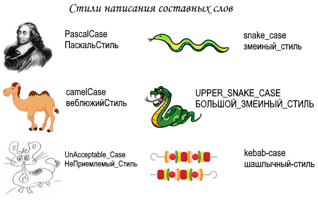

# Угоди про імена

## Загальні відомості

При написанні програмного коду, та й під час роботи за комп'ютером завжди доводиться давати ім'я чомусь. При цьому слід дотримуватись:

- по-перше, обмежень щодо допустимого набору символів
- по-друге, загальноприйнятих та якимось чином стандартизованим стилям найменувань

  
Чутливість у іменах файлів

  

    Наприклад, при присвоюванні імен файлів, є обмеження в наборах символів, які залежать від операційної системи (ОС), а також можуть бути чутливими до регістру.
  

При кодуванні ж конкретною мовою програмування визначено свій набір допустимих символів, причому не залежить від ОС, і чутливість до регістру визначено свою.

## Стилі написання складових слів

### Загальні зауваження

Стиль написання складових слів одна із найважливіших угод про найменування в мовах програмування, причому їх може бути дещо в одній мові, але для різних цілей.

Навіть серед найпоширеніших стилів написання складових слів у різних джерелах є плутанина.

  
Плутанина у стилях

  

Наприклад, стиль `PascalCase` часто плутають з `camelCase`, але це, проте, окремий стиль. Також зустрічається, що для `camelCase` вводять уточнюючі стилі, такі як `upperCamelCase` та `lowerCamelCase`.
  

Зроблено спробу усунути такі невідповідності, у тому числі в самих назвах цих стилів, які мають говорити самі за себе. Нижче описано основні стилі, очищені від будь-яких модифікацій.

### PascalCase

У стилі `PascalCase` всі слова пишуться разом між собою, при цьому кожне слово всередині імені пишеться з великої літери.

Приклади: `UserLoginCount`, `DefaultContentManager`

_Зустрічаються псевдоніми_ `CamelCase`, `upperCamelCase`, _ які, по можливості, не використовуйте_.

### camelСase

У стилі `camelCase` ("Верблюжий", "Горбатий") всі слова пишуться разом між собою і з великої літери починаються всі слова, крім першого.

Приклади: `userLoginCount`, `defaultContentManager`

Зустрічаються псевдоніми `lowerCamelCase`, які, по можливості, не використовуйте.

### snake_case

У стилі `snake_case` («Зміїний») всі слова поділяються символом підкреслення і пишуться малими літерами.

Приклади: `user_login_count`, `default_content_manager`

### UPPER_SNAKE_CASE

У стилі `UPPER_SNAKE_CASE` («Зміїний у верхньому регістрі») всі слова поділяються символом підкреслення і пишуться великими літерами.

Приклади: `USER_LOGIN_COUNT`, `DEFAULT_CONTENT_MANAGER`

### kebab-case

У стилі `kebab-case` ("Шашличний") всі слова поділяються символом дефісу і пишуться малими літерами.

Приклади: `user-login-count`, `default-content-manager`

## Угоди у мовах

У розділі коротко наводяться основні угоди про найменування у поширених мовах програмування.

### C# (С-sharp, Си-шарп)

- **PascalCase** : класи, методи, властивості, інтерфейсні, структури, перерахування (перед іменем інтерфейсу додається символ **I**)
- **camelCase** : змінні, включаючи параметри методів
- **UPPER_SNAKE_CASE** : константи

Додатково:

- [.NET - Правила именования](https://docs.microsoft.com/ru-ru/dotnet/standard/design-guidelines/naming-guidelines)
- [.NET - Руководство по языку C#](https://docs.microsoft.com/ru-ru/dotnet/csharp/)

### F# (эф-шарп)

- **PascalCase** : типи, методи, властивості, поля, інтерфейсні типи, теги об'єднання
- **camelCase** : параметри, внутрішні let-значення

Додатково:

- [.NET - F#. Соглашения об именах](https://docs.microsoft.com/ru-ru/dotnet/fsharp/style-guide/component-design-guidelines#naming-conventions)
- [.NET - Руководство по языку F#](https://docs.microsoft.com/ru-ru/dotnet/fsharp/)
- [fsharp.org - Learning F#](https://fsharp.org/learn.html)

### C++

См. [Google C++ Style Guide](https://google.github.io/styleguide/cppguide.html)

### TypeScript

- **PascalCase** : імена типів, що перераховуються значення
- **camelCase** : імена функцій, властивостей та локальних змінних

Додатково:

- [Microsoft. Руководство по кодированию](https://github.com/microsoft/TypeScript/wiki/Coding-guidelines)
- [Angular. Руководство по стилю](https://angular.io/guide/styleguide#general-naming-guidelines)
- [typescriptlang.org - Документация](https://www.typescriptlang.org/docs/)

### JavaScript

- **PascalCase** : класи та конструктори
- **camelCase** : функції, об'єкти або екземпляри

Додатково:

- [Руководство по написанию JavaScript-кода от Airbnb](https://github.com/leonidlebedev/javascript-airbnb)
- [w3schools.com - JavaScript учебник](https://www.w3schools.com/js/)
- [javascript.ru - Советы по стилю кода](https://learn.javascript.ru/coding-style)
- [MDN - Изучение веб-разработки. JavaScript](https://developer.mozilla.org/ru/docs/Learn/JavaScript)
- [Google JavaScript Style Guide](https://google.github.io/styleguide/jsguide.html)

### Python (Пітон)

- **PascalCase** : класи
- **UPPER_SNAKE_CASE** : константи
- **snake_case** : всі інші імена

Додатково:

- [PEP 8 -- Style Guide for Python Code](https://www.python.org/dev/peps/pep-0008/)
- [ПИТОНТЬЮТОР - Бесплатный курс](https://pythontutor.ru/)

> PEP (англ. Python Enhancement Proposal) — пропозиції щодо розвитку Python
