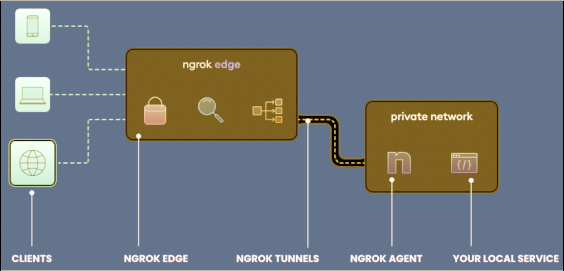

# Засоби розробника

## Багатоплатформні

### IDE и среды выполнения

- [Visual Studio](https://visualstudio.microsoft.com/ru/) - наиболее полная интегрированная среда разработки для разработчиков .NET и C++ в Windows.Полноценный набор инструментов и функций для улучшения и усовершенствования каждого этапа разработки программного обеспечения. Для Windows и MacOS.
- [Visual Studio Code](https://visualstudio.microsoft.com/ru/#vscode-section) - это упрощенный, но мощный редактор исходного кода, который работает на компьютере и доступен для Windows, macOS и Linux. Имеет встроенную поддержку JavaScript, TypeScript и Node.js, а также обширную экосистему расширений для других языков и сред выполнения (например, C++, C#, Java, Python, PHP, Go, .NET).
- [Node.js® — nodejs.org](https://nodejs.org/uk) - это кросс-платформенная среда выполнения JavaScript с открытым исходным кодом.

### Git (DVCS)

:::info DVCS - распределенная система контроля версий

Распределенная система управления версиями (DVCS) предоставляет локальную копию полного репозитория на компьютер каждого члена команды, поэтому они могут локально выполнять фиксацию, ветвление и слияние. Серверу не нужно хранить физический файл для каждой ветки — ему просто нужны различия между каждым коммитом.

Распределенные системы управления версиями  помогают командам разработчиков программного обеспечения создавать надежные рабочие процессы и иерархии, при этом каждый разработчик вносит изменения в код в свой собственный репозиторий, а сопровождающие настраивают процесс проверки кода , чтобы обеспечить слияние только качественного кода в основной репозиторий.

:::

- [Git](https://git-scm.com/) - это бесплатная распределенная система управления версиями с открытым исходным кодом, предназначенная для быстрой и эффективной обработки любых проектов, от небольших до очень крупных.
- [GitHub](https://github.com/) - один з найбільших вебсервісів для спільної розробки програмного забезпечення. Існують безкоштовні та платні тарифні плани користування сайтом. Базується на системі керування версіями Git
- [GitHub Desktop](https://desktop.github.com/) - упрощает рабочий процесс разработки. Для Windows и MacOS.
- [Gitea](https://about.gitea.com/) - это легкая платформа DevOps, предназначенная для самостоятельного хостинга. Он позволяет командам и разработчикам выполнять высокоэффективные и простые операции от планирования до производства. 

### Менеджеры пакетов и хостинг пакетов

:::info Системы управления пакетами

[Система управления пакетами](https://ru.wikipedia.org/wiki/Система_управления_пакетами) (также иногда «менеджер пакетов» или «пакетный менеджер») — набор программного обеспечения, позволяющего управлять процессом установки, удаления, настройки и обновления различных компонентов программного обеспечения.

- [Что такое менеджер пакетов, и в чем разница YARN, NPM, PNPM? — habr.com](https://habr.com/ru/articles/726096/)

:::

- [NuGet — learn.microsoft.com](https://learn.microsoft.com/ru-ru/nuget/what-is-nuget) - это менеджер пакетов для .NET. Клиентские инструменты NuGet позволяют создавать и использовать пакеты.
- [NuGet Gallery — nuget.org] - это центральный репозиторий пакетов, используемый всеми авторами и потребителями пакетов.
- [BaGet — github.com](https://github.com/loic-sharma/BaGet) - облегченный сервер NuGet и символов для самостоятельного хостинга
- [npmjs.com](https://www.npmjs.com/) - бесплатный реестр npm стал центром обмена кодом JavaScript и крупнейшим в мире реестром программного обеспечения с более чем двумя миллионами пакетов.

### Контейнерные платформы

:::info Контейнеры

Контейнеры используются для создания, совместного использования и запуска приложений.

Контейнер — это стандартная единица программного обеспечения, которая упаковывает код и все его зависимости, чтобы приложение быстро и надежно запускалось в одной вычислительной среды из другой. 

:::

- [Docker Personal — docker.com](https://www.docker.com/products/personal/) - Docker Personal включает в себя все необходимое для создания, совместного использования и запуска облачных приложений. Общедоступные репозитории, для обмена образами контейнеров со своей командой, клиентами или сообществом Docker в целом.
- [Docker Desktop — docker.com](https://www.docker.com/products/docker-desktop/) - это приложение для компьютеров с macOS, Linux и Windows, позволяющее быстро и безопасно создавать и совместно использовать контейнерные приложения и микросервисы.
- [Docker Hub — hub.docker.com](https://hub.docker.com/) - это самый простой в мире способ создания, управления и доставки контейнерных приложений, крупнейшая в мире
библиотека и сообщество образов контейнеров.

### Тунелі localhost ⇄ Internet

Тунелі використовуються:
- для налагодження та тестування на локальному хості веб-застосунку, яка взаємодіє із зовнішнім Інтернет-сервісом. При цьому додаток зобов'язаний надати зовнішньому сервісу кінцеву точку з доступом https-протоколу.
- потрібно показати роботу веб-застосунку іншим до розгортання його у виробничому середовищі.

- [ngrok — ngrok.com](https://ngrok.com/)
- [localtunnel — theboroer.github.io](https://theboroer.github.io/localtunnel-www/)
- [localhost.run](https://localhost.run/)
- [ngrok — Когда нужно прокинуть ваш сервис в Интернет — mkdev.me](https://mkdev.me/ru/posts/ngrok-kogda-nuzhno-prokinut-vash-servis-v-internet)
- [Как без белого IP локальный веб-сервер сделать доступным из Интернета — ](https://hackware.ru/?p=11769)
- [Using SSH and localhost.run to test GitHub webhooks locally — andrewlock.net](https://andrewlock.net/using-ssh-and-localhost-run-to-test-github-webhooks-locally/)

### Базы данных

- [Azure Data Studio — learn.microsoft.com](https://learn.microsoft.com/ru-ru/sql/azure-data-studio/download-azure-data-studio?) - кросс-платформенное решение для специалистов по работе с данными, использующих локальные и облачные платформы данных в Windows, macOS и Linux.
- [SQLiteStudio — sqlitestudio.pl](https://sqlitestudio.pl/) - create, edit, browse SQLite databases.
- [Лучшие инструменты MySQL на 2023 год — simplilearn.com](https://www.simplilearn.com/top-mysql-tools-article)
- [Top-Rated PostgreSQL GUI Tools 2023](https://blog.devart.com/best-postgresql-gui-tools.html)

- [SQL Server](https://www.microsoft.com/ru-ru/sql-server/) - современная платформа данных
- [MySQL Community Server](https://dev.mysql.com/downloads/mysql/) - представляет собой систему управления реляционными базами данных (RDBMS) с открытым исходным кодом. 
- [PostgreSQL](https://www.postgresql.org/) - мощная система объектно-реляционных баз данных с открытым исходным кодом, активно разрабатываемая более 35 лет и заслужившая прочную репутацию за надежность, надежность функций и производительность.
- [SQLite](https://www.sqlite.org/) - библиотека на языке C, которая реализует небольшой, быстрый, автономный, высоконадежный, полнофункциональный механизм базы данных SQL. SQLite — самая используемая СУБД в мире. SQLite встроен во все мобильные телефоны и большинство компьютеров и входит в состав бесчисленного множества других приложений, которые люди используют каждый день.

- [The Connection Strings Reference — connectionstrings.com](https://www.connectionstrings.com/) - справочник о строках подключения, база знаний со статьями и информацией о подключении к базе данных

### Локализация

- [ResXManager — marketplace.visualstudio.com](https://marketplace.visualstudio.com/items?itemName=TomEnglert.ResXManager) - расширение для Visual Studio
- [PoExtractor — github.com](https://github.com/lukaskabrt/PoExtractor)
  утилита извлекает переводимые строки из кода C # и VB, шаблонов Razor и шаблонов Liquid в файлы POT (шаблон переносимого объекта). Он разработан с учетом соглашений, используемых в проекте [OrchardCore](https://docs.orchardcore.net/en/dev/docs/reference/modules/Localize/).
 
### Разное

- [Swagger](https://swagger.io/) - разработка API для пользователей, команд и предприятий с помощью открытого и профессионального набора инструментов Swagger.
- [LiveReloadServer — github.com](https://github.com/RickStrahl/LiveReloadServer) - 
автономный, локальный, кросс-платформенный, статический файловый веб-сервер с автоматической перезагрузкой в ​​реальном времени, рендерингом Markdown и свободной поддержкой Razor Pages. [Rick Strahl's Weblog](https://weblog.west-wind.com/posts/2021/Mar/23/LiveReloadServer-A-NET-Core-Based-Generic-Static-Web-Server-with-Live-Reload)
- [smtp4dev — github.com](https://github.com/rnwood/smtp4dev) - фиктивный почтовый сервер smtp для разработки и тестирования
- [Chrome для тестирования — developer.chrome.com](https://developer.chrome.com/blog/chrome-for-testing/) - версия Chrome, специально предназначенная для тестирования веб-приложений и автоматизации.

## Windows

- [Git for windows](https://gitforwindows.org/) - легковесный, родной набор инструментов, которые привносят полный набор функций Git SCM в Windows, обеспечивая при этом соответствующие пользовательские интерфейсы как для опытных пользователей Git, так и для новичков.

- [LINQPad — linqpad.net](https://www.linqpad.net/) - площадка для программистов .NET.
    LINQPad предназначен не только для запросов LINQ, но и для любых выражений C#/F#/VB, блоков операторов или программ . Положите конец сотням консольных проектов Visual Studio, загромождающих исходную папку, и присоединитесь к революции сценаристов LINQPad и добавочных разработчиков.

    Ссылайтесь на собственные сборки и пакеты NuGet. Создавайте прототипы своих идей в LINQPad, а затем вставляйте рабочий код в Visual Studio. Или вызывайте свои сценарии непосредственно из командной строки .

### Работа с БД

- [SQL Server Management Studio](https://docs.microsoft.com/ru-ru/sql/ssms/) (SSMS) — это интегрированная среда для управления любой инфраструктурой SQL, от SQL Server до баз данных SQL Azure. SSMS предоставляет средства для настройки, наблюдения и администрирования экземпляров SQL Server и баз данных. С помощью SSMS можно развертывать, отслеживать и обновлять компоненты уровня данных, используемые вашими приложениями, а также создавать запросы и скрипты.
- [SQLite Expert — sqliteexpert.com](https://www.sqliteexpert.com/) - мощный инструмент, предназначенный для упрощения разработки баз данных SQLite3. Это многофункциональный инструмент администрирования и разработки для SQLite , предназначенный для удовлетворения потребностей всех пользователей, от написания простых SQL-запросов до разработки сложных баз данных.

## Linux