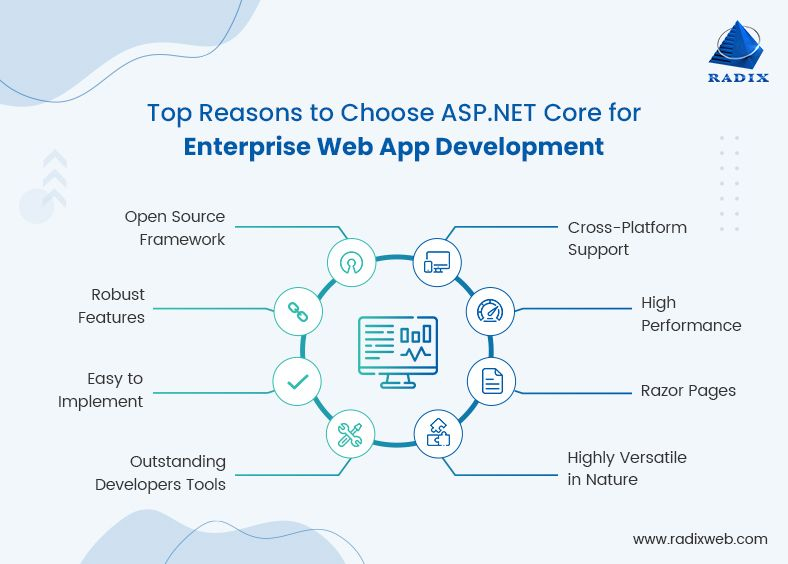
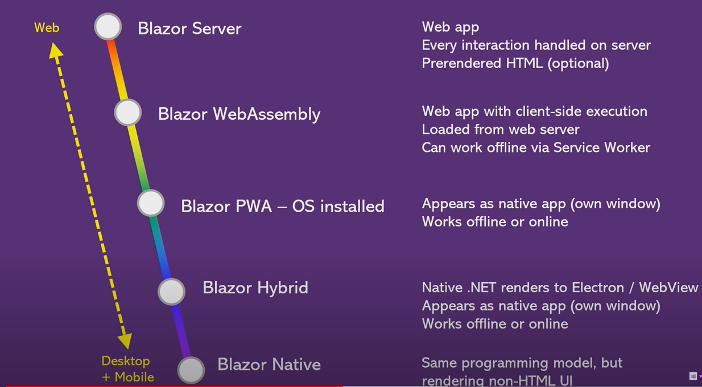

# ASP.NET Core

## Огляд

ASP.NET Core є кросплатформовим, високопродуктивним середовищем з відкритим вихідним кодом для створення сучасних хмарних програм, підключених до Інтернету, або працюючих в Інтранеті (внутрішньокорпоративна мережа).

- [ASP.NET documentation — learn.microsoft.com](https://learn.microsoft.com/ru-ru/aspnet/core/)
- [ASP.NET Core — github.com](https://github.com/dotnet/aspnetcore)
- [Samples for ASP.NET Core — github.com](https://github.com/aspnet/samples)
- [8 основных причин, по которым ASP.NET Core является лучшей платформой для разработки веб-приложений — radixweb.com](https://radixweb.com/blog/8-reasons-asp-dot-net-core-is-best-framework)

## Blazor

Blazor представляет UI-фреймворк для создания интерактивных приложений, которые могут работать как на стороне сервера, так и на стороне клиента, на платформе .NET.

- [ASP.NET Core Blazor — learn.microsoft.com](https://learn.microsoft.com/ru-ru/aspnet/core/blazor/)
- [Введение в Blazor — metanit.com](https://metanit.com/sharp/blazor/)
- [Статические файлы Blazor в ASP.NET Core — learn.microsoft.com](https://learn.microsoft.com/ru-ru/aspnet/core/blazor/fundamentals/static-files?)
- [Модели размещения ASP.NET Core Blazor — learn.microsoft.com](https://learn.microsoft.com/ru-ru/aspnet/core/blazor/hosting-models?)
- [Прогрессивное веб-приложение (PWA) Blazor ASP .NET Core — learn.microsoft.com](https://learn.microsoft.com/ru-ru/aspnet/core/blazor/progressive-web-app?tabs=visual-studio)
- [MudBlazor — mudblazor.com](https://mudblazor.com/) - бібліотека компонентів Blazor, заснована на дизайні матеріалів з упором на простоту використання. В основному написаний на C# з мінімальною кількістю Javascript, він дозволяє розробникам .NET легко налагодження його, якщо це необхідно.
- [Изучите шаблоны MudBlazor в Visual Studio 2022 — medium.com](https://medium.com/knowledge-pills/explore-mudblazor-template-in-visual-studio-2022-e936bc7e393)
- [Blazor WebAssembly | .Net7 API | MudBlazor | CRUD - Create Sample SQL Table & MudBlazor Project](https://www.learmoreseekmore.com/)
- [Blazor Bootstrap — getblazorbootstrap.com](https://getblazorbootstrap.com/) - Бібліотека компонентів Blazor Bootstrap корпоративного класу, створена на основі CSS Blazor і Bootstrap.
- [Fluent UI Blazor Components — fluentui-blazor.net](https://www.fluentui-blazor.net/)
- [Использование веб-компонентов Fluent UI с Blazor — learn.microsoft.com](https://learn.microsoft.com/ru-ru/fluent-ui/web-components/integrations/blazor)

