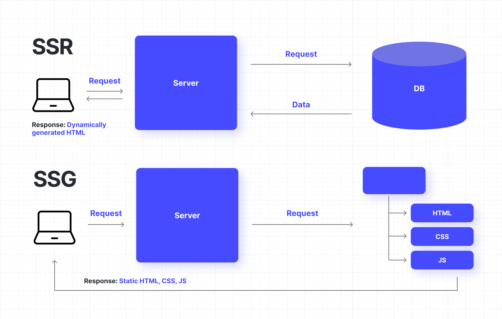

# Стратегії рендерингу

## Загальні відомості

При створенні веб-додатків дуже важливо вибрати правильну стратегію рендерингу, щоб оптимізувати продуктивність, покращити взаємодію з користувачем та покращити видимість у пошукових системах.

Основні типи рендерингу сайту:

- **генерація статичних сайтів (SSG)**

  :::info SSG - Static Site Generation
  HTML, CSS и JavaScript вже створені під час публікації сайту. 
  Забезпечує чудову продуктивність та безпеку при одночасному зниженні навантаження на сервер.
  З точки зору SEO — це ідеальний варіант. 
  SSG ідеально підходить для веб-сайтів з вмістом, що нечасто змінюється,
  таким як блоги, маркетингові сторінки або документація.

  *Фреймворки/бібліотеки/технології/генератори*: Material for MkDocs, Docusaurus, Next.js 
  :::

- **рендеринг на стороні сервера (SSR)**

  :::info SSR - Server-Side Rendering
  HTML-сторінка генерується динамічно на сервері. 
  Спосіб гарантує, що пошукові системи зможуть ефективно індексувати контент. 
  SSR особливо корисний для програм з динамічними даними, які часто змінюються або потребують персоналізованої інформації.

  *Фреймворки/бібліотеки/технології*: Next.js, Vue, ASP.NET Core: MVC і Razor Pages, Blazor Server.
  :::

- **рендеринг на стороні клієнта (CSR)**

  :::info CSR - Client-Side Rendering
  HTML-сторінка генерується динамічно на стороні клієнта з використанням JavaScript. Дані витягуються з сервера через API. 
  Менше навантаження на сервер. Не оптимально для SEO. 
  Легкість масштабування, і дані можуть використовуватися різними клієнтами (вебсторінки, мобільні додатки, інші сервера). 
  Оскільки використовується JavaScript для керування всім сайтом, початкова швидкість завантаження сторінок може знизитися зі збільшенням розміру пакета. Однак після завантаження він працює дуже швидко і дає відчуття, подібне до нативного додатку.

  *Фреймворки/бібліотеки/технології*: Vue, React, Angular, ASP.NET Core: Blazor WASM,.
  :::

Багато фреймворків/технологій підтримують кілька видів рендерингу. Також в одному додатку може бути задіяний більш, ніж один вид рендерингу.

## Додатково

- [Порівнюємо способи генерації сторінок — dou.ua](https://dou.ua/forums/topic/41585/)
- [CSR, SSR, SSG: типы рендеринга и какой из них лучше использовать — dou.ua](https://dou.ua/forums/topic/31720/)
- [Server-Side Rendering (SSR) — vuejs.org](https://vuejs.org/guide/scaling-up/ssr.html)
- [NextJS 13. Варианты рендеринга - RSC, CSR, SSR, SSG, ISR — youtube.com](https://www.youtube.com/watch?v=EH1WsQGSrWU)
- [Exploring Blazor Changes in .NET 8 - Server Side Rendering (SSR) — jonhilton.net](https://jonhilton.net/blazor-ssr/)