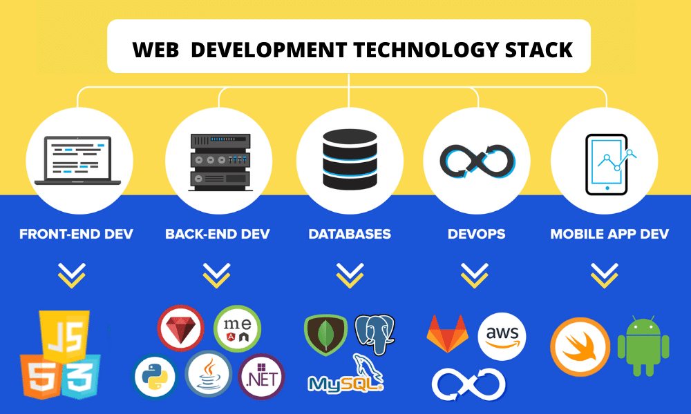

# Технологічні стеки

## Загальні відомості

Технологічний стек — це набір інструментів, мов програмування та технологій, які працюють разом для створення цифрових продуктів або рішень, таких як веб-сайти, мобільні або веб-програми.

Інакше технологічний стек визначається набір технологій, які організація використовує до створення ПЗ. Це комбінація мов програмування, фреймворків, бібліотек, шаблонів, серверів, рішень UI/UX, програмного забезпечення та інструментів, які використовуються розробниками.

Вибір правильного технологічного стека забезпечує ремонтопридатність та масштабованість вашого продукту. Немає ідеального технологічного, тому вибір найкращого для вивчення залежить від ваших інтересів та можливостей працевлаштування поряд з вами.

## Популярні стеки

Далі розглядаються популярні стеки розробки веб-додатків. При цьому угруповання стеків базується на основних компонентах стека, використовуваних готовими додатками у робочому середовищі.

### MExN (MEAN, MERN, MEVN)

MExN заснований на JavaScript, зручний для JSON та швидкий. MExN означає його компоненти:

- **M = MongoDB (БД NoSQL)
- E = Express.js (серверная веб-инфраструктура)
- A, R, V = Angular, React, Vue (інтерфейсний фреймворк)
- N = Node.js (кросплатформовий сервер з відкритим вихідним кодом)

Багато розробників використовують стек MEхN для швидкого складання адаптивних веб-додатків та мобільних додатків. Істотною перевагою є відкрита бібліотека безкоштовних модулів.

### LAMP

LAMP керує сотнями мільйонів веб-сайтів. Підраховано, що 3/4 Інтернет працює на стеку LAMP. LAMP легко вивчати та розвивати. Через його поширення легко знайти розробників LAMP.

LAMP означає його компоненти:

- L = Linux (операційна система)
- A = Apache (HTTP-сервер)
- M = MySQL (управління реляційними базами даних)
- P = PHP (мова програмування)

### ASP.NET Core

ASP.NET Core є кросплатформовим, високопродуктивним середовищем з відкритим вихідним кодом для створення сучасних хмарних програм, підключених до Інтернету. Цє єдине рішення для створення користувальницького веб-інтерфейсу, веб-API та серверних частин додатків.

ASP.NET Core дозволяє виконувати такі завдання:

- Створювати веб-програми та служби, програми Інтернету речей (IoT) та серверні частини для мобільних програм.
- Використовувати вибрані засоби розробки у Windows, macOS та Linux.
- Розгортання в хмарі або локальному середовищі.
- Запускати у .NET.

ASP.NET Core легко інтегрується з поширеними клієнтськими платформами та бібліотеками, у тому числі Blazor, Angular, React та Bootstrap.

### Ruby on Rails (RoR)

Ruby on Rails також використовується на тисячах веб-сайтів із дуже високим трафіком. Розробники Ruby on Rails використовують веб-фреймворк для створення різних веб-сайтів та веб-застосунків.

- Ruby (мова програмування)
- on
- Rails (Rails - це бібліотека, що розширює можливості Ruby)

## Додатково

- [What is a Tech Stack? A Complete Beginner’s Guide — careerfoundry.com](https://careerfoundry.com/en/blog/web-development/what-is-a-tech-stack/)