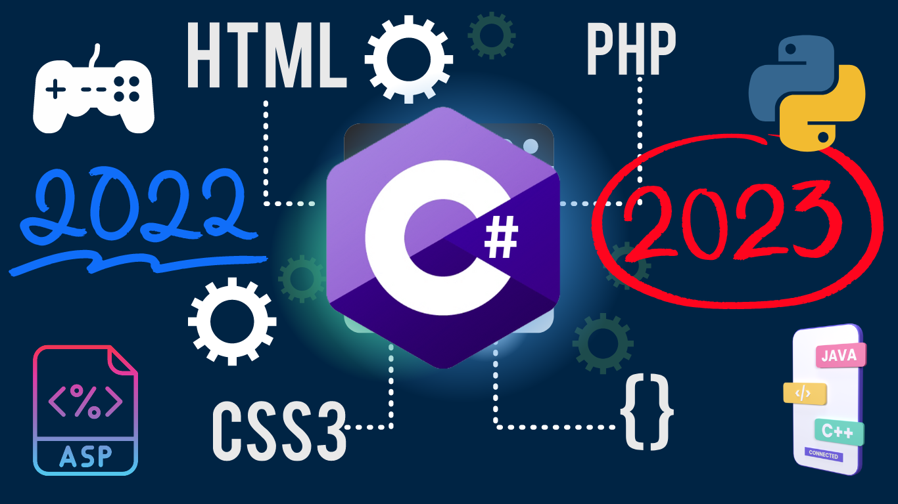

# C Sharp (C#)

## Загальні відомості

C# (вимовляється як "сі шарп") - сучасна об'єктно-орієнтована і типобезпечна мова програмування. C# дозволяє розробникам створювати різні типи безпечних та надійних програм, що виконуються в .NET. C# відноситься до широко відомого сімейства мов C, і здасться добре знайомим будь-кому, хто працював з C, C++, Java або JavaScript.

C# добре підходить для створення широкого кола кросплатформових додатків та веб-додатків.
C# також широко використовується для розробки ігор.

- [Документация по C# — learn.microsoft.com](https://learn.microsoft.com/ru-ru/dotnet/csharp/)
- [C# Shell .NET IDE — play.google.com](https://play.google.com/store/apps/details?id=com.radinc.csharpshell&hl=ru) - мобільний додаток. Компілюйте та вивчайте C# на ходу за допомогою Mono CLR під Android

## Чому C# та .NET актуальні

### Кросплатформна розробка

За допомогою C# і .NET ви можете створювати програми, які можуть працювати на кількох платформах, включаючи Windows, macOS, Linux і навіть на мобільних пристроях з iOS і Android. Ви можете охопити широку аудиторію та створювати програми, які можна використовувати на різних типах пристроїв.

### Інтеграція з продуктами Microsoft

Освоєння C# і .NET полегшує розробку та розгортання програм на платформі Microsoft, що ідеально підходить, якщо ви працюєте в компаніях, які значною мірою покладаються на такі технології, як Azure і Visual Studio. Ці навички також можуть дозволити вам працювати з  моделями штучного інтелекту, таких як ChatGPT і Bing AI від Microsoft, які сьогодні все більше набувають популярності в багатьох галузях.

### Масштабованість

C# і .NET — це високомасштабовані технології, які підходять для малих і великих програм, включаючи настільні, веб-додатки, ігрові та мобільні додатки, що робить їх ідеальними для програм корпоративного рівня. Ця універсальність також означає, що ви можете використовувати ці технології для створення будь-якого типу програми, яка найкраще відповідає вашим вимогам і вимогам вашої організації.

### Високий попит на ринку праці

Розробники на C# та .NET користуються великим попитом як серед стартапів, так і серед великих технологічних компаній. Роботодавці завжди шукають розробників з досвідом роботи з .NET і C#, оскільки ці технології зараз часто використовуються в додатках корпоративного рівня. З огляду на такий попит, інвестування вашого часу та зусиль в оволодіння цими навичками може виділити вас і значно збільшити ваші шанси на працевлаштування навіть у сучасній нестабільній економіці.

### Активна спільнота розробників

C# та .NET мають велику та активну спільноту розробників, надаючи численні ресурси для навчання та розвитку, включаючи онлайн-підручники, форуми та документацію. Тож незалежно від того, новачок ви чи досвідчений розробник, ви зможете знайти достатню підтримку, яка допоможе вам навчатися та розвиватися.

### Легко навчитися

Вивчити C# відносно простіше, особливо якщо ви вже знайомі з іншими об'єктно-орієнтованими мовами програмування, такими як Java або C++. Його простий синтаксис має бути одночасно потужним і безпечним для типів, тому ви можете почати створювати програми швидко та ефективно, не покладаючись на круту криву навчання.

## Версії та можливості

|Версія|Нове|Примітка|
|------|----|--------|
|C# 8|[2019-09](https://learn.microsoft.com/ru-ru/dotnet/csharp/whats-new/csharp-version-history#c-version-80)|.NET Core 3.0+, NET Standard 2.1|
C# 9|[2020-11](https://learn.microsoft.com/ru-ru/dotnet/csharp/whats-new/csharp-9)|.NET 5.0+|
|C# 10|[2021-11](https://learn.microsoft.com/ru-ru/dotnet/csharp/whats-new/csharp-10)|.NET 6.0+|
|C# 11|[2022-11](https://learn.microsoft.com/ru-ru/dotnet/csharp/whats-new/csharp-11)|.NET 7.0+|
|C# 12|[2023-12](https://learn.microsoft.com/ru-ru/dotnet/csharp/whats-new/csharp-12?)|.NET 8.0+|

## Додаткові матеріали

- [5 REASONS WHY YOU SHOULD LEARN C# IN 2023 — coderschmoder.com](https://www.coderschmoder.com/5-reasons-why-you-should-learn-c-sharp-in-2023/)
- [Why C# and .NET are still relevant in 2023 — educative.io](https://www.educative.io/blog/c-sharp-dot-net-relevance)
- [C# 2023 С НУЛЯ ДО ПРОФИ | СЛИВ ЛУЧШЕГО КУРСА — youtube.com](https://www.youtube.com/watch?v=w8rRhAup4kg)
- [Why C# and .NET are still relevant in 2024 — educative.io](https://www.educative.io/blog/c-sharp-dot-net-relevance)
- [C# language versioning — learn.microsoft.com](https://learn.microsoft.com/en-us/dotnet/csharp/language-reference/configure-language-version)
