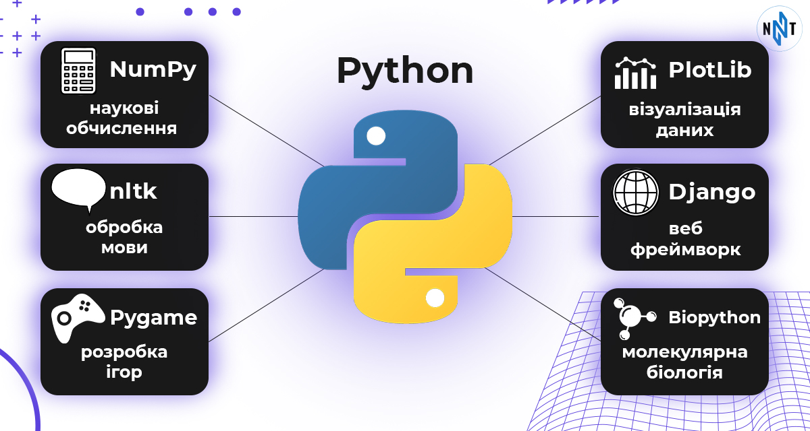

# Python

Python — це високорівнева що інтерпретується мова програмування з простим синтаксисом, який робить його легко читаним і надзвичайно зручним для користувачів і новачків.

- [python.org](https://www.python.org/)
- [Pydroid 3 - IDE for Python 3 — play.google.com](https://play.google.com/store/apps/details?id=ru.iiec.pydroid3) - мобільний додаток. Найпростіша у використанні та потужна навчальна IDE Python 3 для Android
- [Python - мова, що перевершує очікування: переваги, можливості та поради початківцям — nt.ua](https://nt.ua/blog/python-is-a-language-that-exceeds-expectations)
- [Пояснено, чому Python продовжує розвиватися — github.blog](https://github.blog/2023-03-02-why-python-keeps-growing-explained/)
- [Уроки Python — acode.com.ua](https://acode.com.ua/lessons-python/)
- [Онлайн курс Python — geek-university.com](https://geek-university.com/python-online-course/) - це освітній веб-сайт, що пропонує багато безкоштовних комп'ютерних онлайн-курсів.

